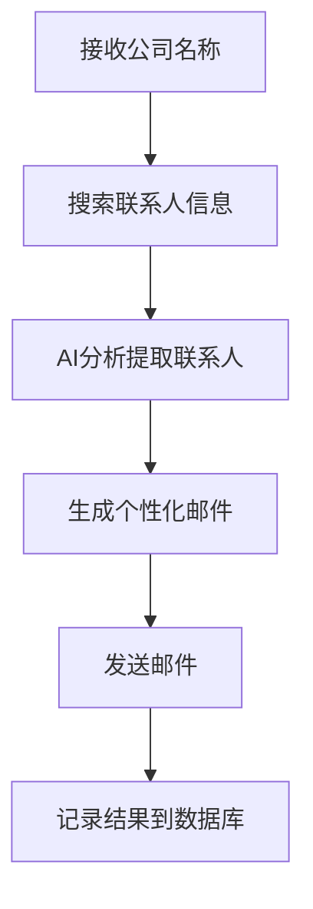

# Smart Lead Agent

一个专门用来在外贸行业寻找线索的 Agent，可以自动根据行业、客户寻找线索然后发送开发信。

## 功能特性

- 🔍 **自动搜索**: 使用 Serper.dev API 自动搜索目标公司的采购联系人信息
- 🤖 **AI 分析**: 使用 GPT-4o 从搜索结果中提取结构化的联系人信息
- ✉️ **个性化邮件**: 基于联系人信息自动生成个性化的开发信
- 📧 **邮件发送**: 支持 SMTP 和 ESP (SendGrid) 两种邮件发送方式
- 📊 **数据追踪**: 完整的数据库记录，支持邮件事件追踪（打开率、点击率等）

## 技术栈

- **FastAPI**: Web 框架
- **SQLAlchemy**: ORM 数据库操作
- **MySQL**: 数据库
- **OpenAI GPT-4o**: AI 分析和内容生成
- **Serper.dev**: 搜索引擎 API
- **SendGrid / SMTP**: 邮件发送服务
- **uv**: 依赖管理和虚拟环境

## 快速开始

### 1. 安装依赖

使用 `uv` 同步依赖（会自动创建虚拟环境并安装所有依赖）：

```bash
uv sync
```

或者分步执行：

```bash
# 创建虚拟环境
uv venv

# 同步依赖（只安装依赖，不安装项目本身）
uv sync --no-install-project
```

### 2. 配置环境变量

复制 `.env.example` 文件并配置必要的环境变量：

```bash
cp .env.example .env
```

编辑 `.env` 文件，填入以下必要配置：

- **数据库配置**: `DB_HOST`, `DB_PORT`, `DB_USER`, `DB_PASSWORD`, `DB_NAME`
- **API 密钥**: `SERPER_API_KEY`, `OPENAI_API_KEY`
- **邮件配置**: 选择 SMTP 或 SendGrid（ESP）配置其一

### 3. 初始化数据库

执行数据库初始化脚本创建表结构：

```bash
mysql -u your_user -p your_database < database/sql/001_initial_schema.sql
```

### 4. 启动服务

使用 `uv` 运行应用：

```bash
# 方式一：直接运行
uv run python main.py

# 方式二：使用 uvicorn（推荐用于开发）
uv run uvicorn main:app --reload
```

或者激活虚拟环境后运行：

```bash
source .venv/bin/activate  # Linux/Mac
# 或
.venv\Scripts\activate     # Windows

python main.py
# 或
uvicorn main:app --reload
```

服务将在 `http://localhost:8000` 启动。

## API 使用

### 生成潜在客户

向 `/generate-lead` 端点发送 POST 请求：

```bash
curl -X POST "http://localhost:8000/generate-lead" \
  -H "Content-Type: application/json" \
  -d '{
    "company_name": "示例公司",
    "search_queries": [
      "{company_name} 采购经理",
      "{company_name} procurement manager"
    ]
  }'
```

### API 文档

启动服务后，访问以下地址查看交互式 API 文档：

- Swagger UI: `http://localhost:8000/docs`
- ReDoc: `http://localhost:8000/redoc`

## 项目结构

```
smart-lead-agent/
├── main.py                 # FastAPI 应用入口
├── config.py               # 配置管理
├── pyproject.toml          # 项目配置和依赖管理（uv）
├── requirements.txt        # Python 依赖（兼容性，推荐使用 pyproject.toml）
├── .env.example            # 环境变量模板
│
├── core/                   # 核心业务模块
│   ├── schemas.py          # 数据传输对象
│   ├── search.py           # 搜索模块
│   ├── analysis.py         # 分析模块
│   ├── generation.py      # 邮件生成模块
│   └── email/              # 邮件发送模块
│       ├── base_sender.py  # 抽象基类
│       ├── smtp_sender.py  # SMTP 实现
│       └── esp_sender.py   # ESP (SendGrid) 实现
│
├── database/               # 数据库层
│   ├── connection.py       # 数据库连接
│   ├── models.py           # ORM 模型
│   ├── repository.py       # 数据访问层
│   └── sql/
│       └── 001_initial_schema.sql  # 数据库初始化脚本
│
└── docs/                   # 文档
    └── architecture_design.md  # 架构设计文档
```

## 工作流程

系统按照以下流程自动化处理潜在客户开发：



## 详细文档

完整的架构设计和系统说明请参阅 [架构设计文档](docs/architecture_design.md)。

## 许可证

MIT License
