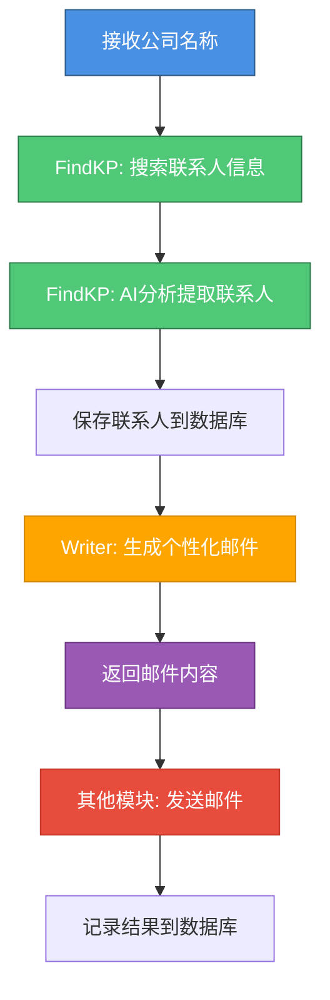

# Smart Lead Agent

一个专门用来在外贸行业寻找线索的 Agent，可以自动根据行业、客户寻找线索然后发送开发信。

## 功能特性

- 🔍 **自动搜索**: 使用 Serper.dev API 自动搜索目标公司的采购联系人信息
- 🤖 **AI 分析**: 使用多种 LLM 模型（GPT-4o、DeepSeek、GLM 等）从搜索结果中提取结构化的联系人信息
- ✉️ **个性化邮件生成**: 基于联系人和公司信息自动生成个性化的 HTML 营销邮件（支持指定 LLM 模型）
- 📧 **批量处理**: 支持批量查找联系人和批量生成邮件
- 📊 **数据追踪**: 完整的数据库记录，支持联系人信息管理和邮件内容管理

## 技术栈

- **FastAPI**: Web 框架
- **SQLAlchemy**: ORM 数据库操作（异步）
- **MySQL**: 数据库
- **LangChain**: LLM 统一接口，支持多种模型
  - **OpenAI GPT-4o**: 通过 OpenRouter 调用
  - **DeepSeek**: 直接调用国内 API
  - **GLM (智谱 AI)**: 支持多种 GLM 模型
  - **Qwen (通义千问)**: 支持多种 Qwen 模型
- **Serper.dev / Google Search**: 搜索引擎 API
- **uv**: 依赖管理和虚拟环境

## 快速开始

### 1. 安装依赖

使用 `uv` 同步依赖（会自动创建虚拟环境并安装所有依赖）：

```bash
uv sync
```

或者分步执行：

```bash
# 创建虚拟环境
uv venv

# 同步依赖（只安装依赖，不安装项目本身）
uv sync --no-install-project
```

### 2. 配置环境变量

复制 `.env.example` 文件并配置必要的环境变量：

```bash
cp .env.example .env
```

编辑 `.env` 文件，填入以下必要配置：

- **数据库配置**: `DB_HOST`, `DB_PORT`, `DB_USER`, `DB_PASSWORD`, `DB_NAME`
- **API 密钥**:
  - `SERPER_API_KEY`: Serper.dev 搜索 API 密钥
  - `OPENROUTER_API_KEY` 或 `OPENAI_API_KEY`: 用于调用 OpenAI/Anthropic 等国外模型
  - `DEEPSEEK_API_KEY`: DeepSeek API 密钥（可选）
  - `GLM_API_KEY`: 智谱 AI API 密钥（可选）
  - `QWEN_API_KEY`: 通义千问 API 密钥（可选）
- **LLM 配置**: `LLM_MODEL`（默认模型，如 "gpt-4o" 或 "deepseek-chat"）

### 3. 初始化数据库

执行数据库初始化脚本创建表结构：

```bash
mysql -u your_user -p your_database < database/sql/001_initial_schema.sql
```

### 4. 启动服务

使用 `uv` 运行应用：

```bash
# 方式一：直接运行
uv run python main.py

# 方式二：使用 uvicorn（推荐用于开发）
uv run uvicorn main:app --reload
```

或者激活虚拟环境后运行：

```bash
source .venv/bin/activate  # Linux/Mac
# 或
.venv\Scripts\activate     # Windows

python main.py
# 或
uvicorn main:app --reload
```

服务将在 `http://localhost:8000` 启动。

## CLI 使用

项目提供了命令行工具，方便在终端环境中直接使用 FindKP 和 Writer 功能。

### 安装 CLI

安装项目依赖后，CLI 工具会自动注册为系统命令：

```bash
# 安装依赖（CLI 会自动注册）
uv sync

# 验证 CLI 是否可用
smart-lead --help
```

### FindKP 命令

使用 `smart-lead findkp` 命令查找公司的关键联系人：

```bash
# 基本用法
smart-lead findkp \
  --company-name-en "Apple Inc." \
  --company-name-local "苹果公司" \
  --country "USA"

# 带详细日志输出
smart-lead findkp \
  --company-name-en "Apple Inc." \
  --company-name-local "苹果公司" \
  --country "USA" \
  --verbose
```

**参数说明**:

- `--company-name-en`: 公司英文名称（必需）
- `--company-name-local`: 公司本地名称（必需）
- `--country`: 国家名称（可选）
- `--verbose` / `-v`: 显示详细日志输出

**示例输出**:

```
============================================================
FindKP - 查找公司关键联系人
============================================================
公司英文名: Apple Inc.
公司本地名: 苹果公司
国家: USA

[INFO] 开始搜索公司信息: 苹果公司 (USA)
[INFO] 生成了 4 个公司信息查询
[INFO] 并行搜索中... (Serper + Google)
[INFO] 聚合结果: 找到 15 条搜索结果
[INFO] LLM 提取公司信息中...
[INFO] ✓ 找到公司域名: apple.com
[INFO] ✓ 找到公司行业: Technology
[INFO] 并行搜索采购和销售部门 KP...
[INFO] ✓ 找到 5 个采购部门联系人
[INFO] ✓ 找到 3 个销售部门联系人
[INFO] 批量保存 8 个联系人...
[INFO] ✓ 完成！

============================================================
✓ 完成！
============================================================
公司 ID: 123
公司域名: apple.com
找到联系人数量: 8

联系人列表:
------------------------------------------------------------
1. John Doe
   邮箱: john.doe@apple.com
   职位: Procurement Manager
   部门: 采购
   置信度: 0.85
   LinkedIn: https://linkedin.com/in/johndoe
...
```

### Writer 命令

使用 `smart-lead writer` 命令生成营销邮件：

```bash
# 根据公司生成邮件（使用默认 LLM）
smart-lead writer generate --company-id 1

# 根据公司名称生成邮件（指定 LLM 模型）
smart-lead writer generate \
  --company-name "Apple Inc." \
  --llm-model "gpt-4o"

# 批量生成邮件（为所有有邮箱的联系人生成）
smart-lead writer batch-generate

# 批量生成邮件（指定 LLM 模型）
smart-lead writer batch-generate \
  --llm-model "deepseek-chat" \
  --verbose
```

**参数说明**:

- `generate` 子命令:
  - `--company-id`: 公司 ID（与 `--company-name` 二选一）
  - `--company-name`: 公司名称（与 `--company-id` 二选一）
  - `--llm-model`: 指定 LLM 模型类型（可选，如 "gpt-4o", "deepseek-chat"）
  - `--verbose` / `-v`: 显示详细日志输出
- `batch-generate` 子命令:
  - `--llm-model`: 指定 LLM 模型类型（可选）
  - `--verbose` / `-v`: 显示详细日志输出

**示例输出**:

```
============================================================
Writer - 生成营销邮件
============================================================
公司 ID: 1
LLM 模型: gpt-4o

[INFO] 公司 Apple Inc. 共有 5 个联系人
[INFO] 去重后（按邮箱）共有 5 个联系人（有邮箱）
[INFO] 开始并发生成邮件...
[INFO] 成功为 5/5 个联系人生成邮件

============================================================
✓ 完成！
============================================================
公司 ID: 1
公司名称: Apple Inc.
生成邮件数量: 5

生成的邮件列表:
------------------------------------------------------------
1. 联系人: John Doe
   邮箱: john.doe@apple.com
   职位: Procurement Manager
   主题: [越南语主题行]
   联系人ID: 123
...
```

### CLI 与 API 的区别

- **CLI**: 适合脚本化、自动化场景，可以在终端直接查看实时日志
- **API**: 适合集成到其他系统，返回结构化 JSON 数据

## API 使用

### FindKP API

查找公司的关键联系人：

```bash
curl -X POST "http://localhost:8000/findkp/search" \
  -H "Content-Type: application/json" \
  -d '{
    "company_name_en": "Apple Inc.",
    "company_name_local": "苹果公司",
    "country": "USA"
  }'
```

### Writer API

生成营销邮件：

```bash
# 根据公司ID生成邮件（使用默认 LLM）
curl -X POST "http://localhost:8000/writer/generate" \
  -H "Content-Type: application/json" \
  -d '{
    "company_id": 1
  }'

# 根据公司名称生成邮件（指定 LLM 模型）
curl -X POST "http://localhost:8000/writer/generate" \
  -H "Content-Type: application/json" \
  -d '{
    "company_name": "Apple Inc.",
    "llm_model": "gpt-4o"
  }'
```

**响应示例**:

```json
{
  "success": true,
  "company_id": 1,
  "company_name": "Apple Inc.",
  "emails": [
    {
      "contact_id": 123,
      "contact_name": "John Doe",
      "contact_email": "john.doe@apple.com",
      "contact_role": "Procurement Manager",
      "subject": "[越南语主题行]",
      "html_content": "<!DOCTYPE html>..."
    }
  ],
  "message": "成功生成 5 封邮件"
}
```

### API 文档

启动服务后，访问以下地址查看交互式 API 文档：

- Swagger UI: `http://localhost:8000/docs`
- ReDoc: `http://localhost:8000/redoc`

## 项目结构

```
smart-lead-agent/
├── main.py                 # FastAPI 应用入口
├── config.py               # 配置管理
├── pyproject.toml          # 项目配置和依赖管理（uv）
├── requirements.txt        # Python 依赖（兼容性，推荐使用 pyproject.toml）
├── .env.example            # 环境变量模板
│
├── findkp/                 # FindKP 业务模块
│   ├── router.py          # API 路由
│   ├── service.py          # 业务逻辑
│   └── prompts.py         # LLM Prompt 模板
│
├── writer/                 # Writer 业务模块
│   ├── router.py          # API 路由
│   ├── service.py         # 业务逻辑（邮件生成）
│   └── prompts.py         # LLM Prompt 模板
│
├── core/                   # 核心业务模块
│   ├── schemas.py          # 数据传输对象
│   ├── search.py           # 搜索模块
│   ├── analysis.py         # 分析模块
│   └── email/              # 邮件发送模块（独立模块）
│       ├── base_sender.py  # 抽象基类
│       ├── smtp_sender.py  # SMTP 实现
│       └── esp_sender.py   # ESP (SendGrid) 实现
│
├── llm/                    # LLM 统一管理
│   ├── factory.py          # LLM 工厂函数
│   └── glm_wrapper.py      # GLM 模型包装器
│
├── database/               # 数据库层
│   ├── connection.py       # 数据库连接
│   ├── models.py           # ORM 模型
│   ├── repository.py       # 数据访问层
│   └── sql/                # SQL 脚本
│       ├── 001_initial_schema.sql
│       └── ...
│
├── schemas/                # 全局数据模型
│   ├── base.py            # 基础响应模型
│   ├── contact.py         # 联系人相关模型
│   └── writer.py          # Writer 相关模型
│
├── cli/                    # CLI 命令行工具
│   ├── __init__.py
│   ├── main.py            # CLI 主入口
│   ├── findkp.py          # FindKP CLI 命令
│   ├── batch_findkp.py    # 批量 FindKP CLI 命令
│   └── writer.py          # Writer CLI 命令
│
└── docs/                   # 文档
    ├── architecture_design.md  # 架构设计文档
    ├── FINDKP_BUSINESS_LOGIC.md  # FindKP 业务逻辑文档
    └── CURSOR_WORK.md      # 开发记录文档
```

## 工作流程

系统按照以下流程自动化处理潜在客户开发：



**模块职责**:

- **FindKP**: 搜索和提取联系人信息
- **Writer**: 生成个性化邮件内容（HTML 格式，包含主题和收件地址）
- **其他模块**: 负责邮件发送（Writer 模块不负责发送）

## 详细文档

- [架构设计文档](docs/architecture_design.md) - 系统整体架构设计
- [FindKP 业务逻辑文档](docs/FINDKP_BUSINESS_LOGIC.md) - FindKP 模块详细业务逻辑和数据流向
- [项目结构文档](docs/PROJECT_STRUCTURE.md) - 项目目录结构和组织规范
- [开发记录文档](docs/CURSOR_WORK.md) - 开发过程中的需求和实现记录

## 主要功能模块

### FindKP 模块

负责搜索和提取公司的关键联系人（KP）信息：

- 使用多种搜索引擎（Serper.dev、Google）并行搜索
- 使用 LLM 提取结构化的联系人信息
- 支持批量处理（从 trade_records 表批量查询）

### Writer 模块

负责生成个性化的营销邮件：

- 基于联系人和公司信息生成 HTML 邮件
- 支持指定不同的 LLM 模型（GPT-4o、DeepSeek、GLM 等）
- 支持批量生成（为所有有邮箱的联系人生成）
- 返回完整的邮件内容、主题和收件地址（不负责发送）

## 许可证

MIT License
