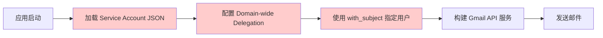
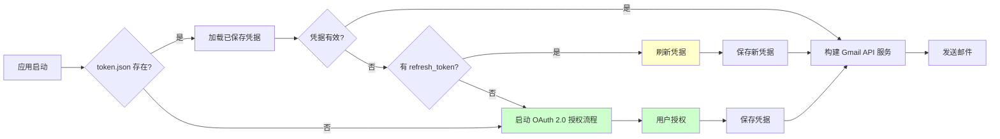
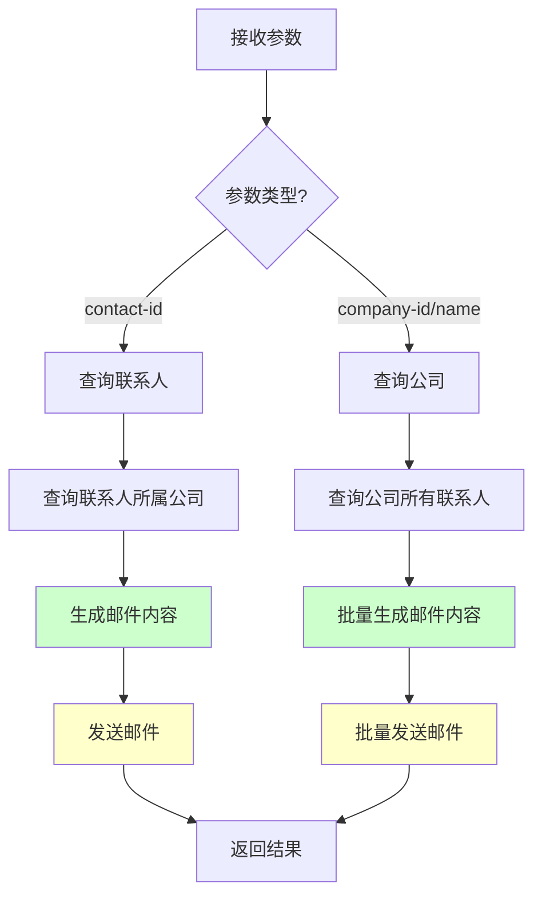
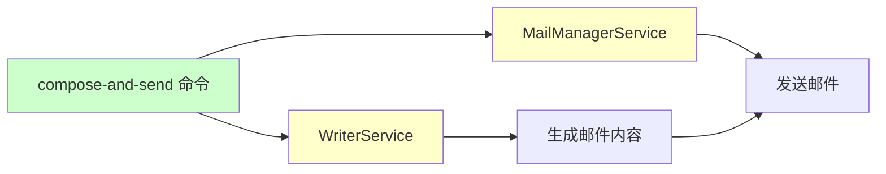
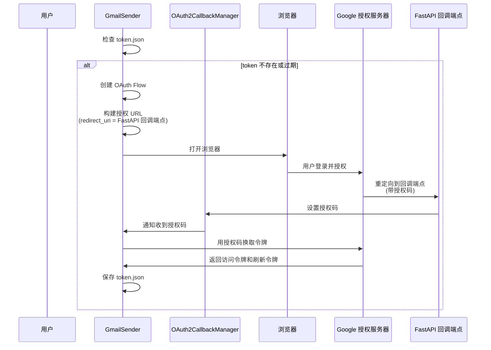
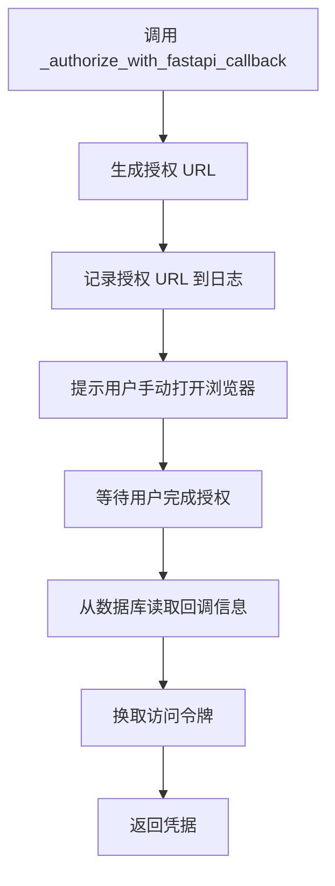

# CURSOR_WORK_25_11_13.md

## 2025-11-13 14:13 - 重构 OAuth2 callback：将业务逻辑移到 service 层

### 需求描述

将 OAuth2 callback 的业务逻辑从 `router.py` 移到 `service.py`，符合架构规范：路由层只处理 HTTP 请求/响应，业务逻辑应该在服务层。

### 实现逻辑

#### 1. 在 service 层添加处理方法 (`mail_manager/service.py`)

添加了 `handle_oauth2_callback()` 方法，负责处理 OAuth2 回调的业务逻辑：

1. **处理错误情况**：

   - 如果有错误参数，保存错误信息到数据库

2. **保存授权码到数据库**（用于跨进程通信，CLI 可能需要）：

   ```python
   await manager.set_authorization_code(code, state=state, db=db)
   ```

3. **立即用授权码换取 token**：

   ```python
   flow = InstalledAppFlow.from_client_secrets_file(
       settings.GOOGLE_OAUTH2_CREDENTIALS_FILE, SCOPES
   )
   flow.redirect_uri = redirect_uri
   flow.fetch_token(code=code)  # 用 code 换取 token
   creds = flow.credentials
   ```

4. **保存 token 到数据库**：
   ```python
   repository = Repository(db)
   token_json = creds.to_json()
   await repository.save_oauth2_token(token_json=token_json, provider="gmail")
   ```

**返回值**：

- 成功：`(True, None)`
- 失败：`(False, error_message)`

#### 2. 简化 router 层 (`mail_manager/router.py`)

`oauth2_callback` 端点现在只负责：

- 接收 HTTP 请求参数
- 调用 service 方法处理业务逻辑
- 根据返回结果生成 HTML 响应

```python
service = MailManagerService()
success, error_message = await service.handle_oauth2_callback(code, state, error, db)

if not success:
    # 返回失败页面
else:
    # 返回成功页面
```

### 授权流程

现在的完整授权流程：

1. **CLI 或 FastAPI 启动授权**：

   - `gmail_sender.py` 的 `_authorize_with_fastapi_callback()` 生成授权 URL
   - 用户手动打开 URL 完成授权

2. **Google 回调到 FastAPI**：

   - 回调到 `/mail_manager/oauth2/callback` 端点
   - 收到 `code` 和 `state` 参数

3. **callback 端点处理**：

   - 保存 `code` 到数据库（用于跨进程通信）
   - **立即用 `code` 换取 `token`**
   - **保存 `token` 到数据库**

4. **后续使用**：
   - `gmail_sender.py` 直接从数据库读取 `token`
   - 如果 token 过期，自动刷新并保存

### 技术细节

1. **Token 换取**：

   - 使用 `InstalledAppFlow.fetch_token(code=code)` 方法
   - 需要确保 `redirect_uri` 与授权时使用的 URL 一致
   - 换取成功后获得 `Credentials` 对象

2. **错误处理**：

   - 如果换取 token 失败，授权码仍然保存在数据库中
   - 用户可以在 CLI 中重试换取 token（如果需要）

3. **跨进程通信**：
   - 授权码仍然保存到数据库，供 CLI 进程使用（如果需要）
   - Token 直接保存到数据库，CLI 和 FastAPI 都可以直接使用

### 影响范围

- ✅ `mail_manager/service.py`: 添加了 `handle_oauth2_callback()` 方法处理业务逻辑
- ✅ `mail_manager/router.py`: 简化了 `oauth2_callback` 端点，只负责 HTTP 处理

### 注意事项

1. **redirect_uri 必须一致**：授权时使用的 `redirect_uri` 必须与换取 token 时使用的 URL 完全一致
2. **错误处理**：如果换取 token 失败，授权码仍然保存在数据库中，可以稍后重试
3. **向后兼容**：授权码仍然保存到数据库，保持与 CLI 的兼容性

---

## 2025-11-13 14:07 - 将 Gmail OAuth2 Token 存储从文件系统改为数据库

### 需求描述

将 `gmail_sender.py` 中的 OAuth2 token 存储方式从文件系统改为数据库存储，参考 `oauth2_manager.py` 的实现方式。这样可以支持跨进程共享 token（CLI 和 FastAPI 可以共享同一个 token）。

### 实现逻辑

#### 1. 创建 OAuth2Token 数据库模型 (`database/models.py`)

添加了 `OAuth2Token` 模型，用于存储 Gmail OAuth 2.0 授权后的 token 信息：

- `provider`: Token 提供者标识（默认 "gmail"），用于区分不同的 token
- `token_json`: Token JSON 数据（完整的 `Credentials.to_json()` 结果）
- `created_at` 和 `updated_at`: 时间戳字段

#### 2. 添加 Repository 方法 (`database/repository.py`)

添加了两个新方法：

- `get_oauth2_token(provider="gmail")`: 从数据库获取 token JSON 字符串
- `save_oauth2_token(token_json, provider="gmail")`: 保存或更新 token 到数据库（支持 upsert）

#### 3. 修改 GmailSender (`mail_manager/senders/gmail_sender.py`)

**主要修改**：

1. **移除文件系统依赖**：

   - 移除了 `Path` 导入
   - 移除了 `GOOGLE_OAUTH2_TOKEN_FILE` 配置检查
   - 移除了文件系统相关的 token 读取和保存逻辑

2. **从数据库读取 token**：

   ```python
   repository = Repository(db)
   token_json = await repository.get_oauth2_token(provider="gmail")
   if token_json:
       token_dict = json.loads(token_json)
       creds = Credentials.from_authorized_user_info(token_dict, SCOPES)
   ```

3. **保存 token 到数据库**：

   - 在获取新 token 后保存到数据库
   - 在刷新 token 后也保存到数据库
   - 使用 `repository.save_oauth2_token()` 方法

4. **增强错误处理**：
   - 要求 `db` 参数必须提供（从数据库读取 token 必需）
   - 添加了详细的日志记录

#### 4. 创建数据库迁移脚本 (`database/sql/010_oauth2_tokens.sql`)

创建了 `oauth2_tokens` 表的 SQL 脚本，包含：

- 主键和索引
- 唯一约束（provider）
- 时间戳字段（created_at, updated_at）

### 技术细节

1. **Token 格式**：

   - 使用 `Credentials.to_json()` 将凭据对象序列化为 JSON 字符串
   - 使用 `Credentials.from_authorized_user_info()` 从字典创建凭据对象
   - 需要传入 `SCOPES` 参数以确保权限正确

2. **跨进程共享**：

   - Token 存储在数据库中，CLI 和 FastAPI 进程可以共享同一个 token
   - 避免了文件系统权限和路径问题

3. **Token 刷新**：
   - 当 token 过期时，自动刷新并保存到数据库
   - 刷新后的 token 立即保存，确保下次使用时是最新的

### 影响范围

- ✅ `database/models.py`: 添加了 `OAuth2Token` 模型
- ✅ `database/repository.py`: 添加了 token 读取和保存方法
- ✅ `mail_manager/senders/gmail_sender.py`: 修改了 token 读取和保存逻辑
- ✅ `database/sql/010_oauth2_tokens.sql`: 新增数据库迁移脚本

### 注意事项

1. **数据库迁移**：需要执行 `010_oauth2_tokens.sql` 脚本创建新表
2. **向后兼容**：如果数据库中没有 token，会自动触发重新授权流程
3. **配置项**：`GOOGLE_OAUTH2_TOKEN_FILE` 配置项不再需要，但保留不影响功能

---

## 2025-11-13 09:44 - 实现 Resend 邮件发送器

### 需求描述

在 `mail_manager/senders` 目录下实现一个新的邮件发送器，用于支持 Resend 服务。Resend 是一个现代化的邮件发送服务，提供简洁的 API 接口。

### 实现逻辑

#### 1. 创建 Resend 发送器 (`mail_manager/senders/resend_sender.py`)

实现了 `ResendSender` 类，继承自 `EmailSender` 抽象基类：

**核心特性**：

- 使用 Resend API Key 进行认证
- 支持异步发送（通过 `asyncio.to_thread` 将同步 API 转换为异步）
- 支持 HTML 和纯文本内容
- 支持发件人和收件人姓名格式化
- 使用 `tenacity` 实现重试机制（最多 3 次，指数退避）

**关键实现点**：

1. **初始化方法** (`__init__`)：

   - 检查 `RESEND_API_KEY` 配置项是否存在
   - 设置 `resend.api_key` 全局变量
   - 记录初始化日志

2. **参数构建方法** (`_build_send_params`)：

   - 格式化发件人地址：`"Name <email@example.com>"` 或 `"email@example.com"`
   - 格式化收件人地址（支持姓名）
   - 构建 Resend API 所需的参数字典
   - 可选添加纯文本内容

3. **发送方法** (`send_email`)：
   - 使用 `@retry` 装饰器实现自动重试
   - 通过 `asyncio.to_thread` 将同步的 Resend API 调用转换为异步
   - 智能处理返回值（支持字典和对象两种格式）
   - 提取消息 ID 并返回
   - 完整的异常处理和日志记录

**返回值处理逻辑**：

```python
# 支持多种返回值格式
if isinstance(email, dict):
    message_id = email.get("id") or email.get("message_id")
else:
    message_id = getattr(email, "id", None) or getattr(email, "message_id", None)
```

#### 2. 更新工厂函数 (`mail_manager/senders/factory.py`)

在 `create_email_sender` 函数中添加了 `resend` 类型的支持：

```python
elif sender_type == "resend":
    logger.info("创建 Resend 发送器实例")
    return ResendSender()
```

**使用方式**：

- 通过环境变量 `EMAIL_SENDER_TYPE=resend` 设置
- 或在代码中显式指定：`create_email_sender("resend")`

#### 3. 更新模块导出 (`mail_manager/senders/__init__.py`)

添加了 `ResendSender` 的导出：

```python
from .resend_sender import ResendSender
__all__ = ["GmailSender", "ResendSender"]
```

#### 4. 更新配置管理 (`config.py`)

在 `Settings` 类中添加了 `RESEND_API_KEY` 配置项：

```python
RESEND_API_KEY: str = ""  # Resend API Key（Resend 发送器使用）
```

同时更新了 `EMAIL_SENDER_TYPE` 的注释，说明支持 `resend` 类型。

### 架构设计

```
mail_manager/senders/
├── __init__.py          # 导出 GmailSender 和 ResendSender
├── factory.py           # 工厂函数，支持创建 gmail/resend/smtp 发送器
├── gmail_sender.py      # Gmail API 发送器实现
└── resend_sender.py     # Resend API 发送器实现（新增）
```

**设计模式**：

- **工厂模式**：通过 `create_email_sender()` 统一创建发送器实例
- **策略模式**：不同的发送器实现相同的 `EmailSender` 接口
- **异步适配**：将同步的 Resend API 通过 `asyncio.to_thread` 转换为异步

### 使用示例

#### 1. 环境变量配置 (`.env`)

```env
# 邮件发送器类型
EMAIL_SENDER_TYPE=resend

# Resend API Key
RESEND_API_KEY=re_xxxxxxxxxxxxx
```

#### 2. 代码中使用

```python
from mail_manager.senders.factory import create_email_sender

# 创建 Resend 发送器
sender = create_email_sender("resend")

# 发送邮件
message_id = await sender.send_email(
    to_email="recipient@example.com",
    to_name="Recipient Name",
    from_email="sender@example.com",
    from_name="Sender Name",
    subject="Hello World",
    html_content="<h1>Hello World</h1>",
    text_content="Hello World"  # 可选
)
```

### 技术细节

1. **异步处理**：

   - Resend Python SDK 是同步的，使用 `asyncio.to_thread` 在后台线程中执行
   - 与 FastAPI 的异步架构保持一致

2. **错误处理**：

   - 捕获所有异常并转换为 `EmailSendException`
   - 记录详细的错误日志
   - 支持重试机制（最多 3 次，指数退避）

3. **兼容性**：
   - 完全兼容现有的 `EmailSender` 接口
   - 返回值格式与 Gmail 发送器保持一致（返回 message_id 字符串）

### 依赖项

Resend Python SDK 已在 `pyproject.toml` 中配置：

```toml
resend>=2.19.0
```

### 测试建议

1. **单元测试**：Mock Resend API 调用，测试参数构建和错误处理
2. **集成测试**：使用真实的 Resend API Key 测试发送功能
3. **异常测试**：测试 API Key 无效、网络错误等场景

### 后续优化建议

1. **批量发送**：如果 Resend 支持批量发送，可以实现批量接口
2. **Webhook 支持**：集成 Resend 的 Webhook 以跟踪邮件状态
3. **模板支持**：如果 Resend 支持邮件模板，可以添加模板功能

---

## 2025-11-13 10:31 - 将 Gmail 发送器从 Service Account 改为 OAuth 2.0 用户授权

### 需求描述

将 Gmail 发送器的认证方式从 Google Workspace 的 Service Account + Domain-wide Delegation 改为标准的 Gmail API OAuth 2.0 用户授权方式。这样可以支持个人 Gmail 账户和标准的 OAuth 2.0 授权流程。

### 实现逻辑

#### 1. 修改 Gmail 发送器认证方式 (`mail_manager/senders/gmail_sender.py`)

**核心变更**：

- **移除**：Service Account 认证方式（`google.oauth2.service_account`）
- **新增**：OAuth 2.0 用户授权方式（`google.oauth2.credentials.Credentials`）
- **新增**：凭据自动刷新机制
- **新增**：首次授权流程支持

**关键实现点**：

1. **凭据管理方法** (`_get_credentials`)：

   - 自动加载已保存的 `token.json` 文件
   - 如果凭据过期，自动使用 `refresh_token` 刷新
   - 如果凭据不存在或刷新失败，启动 OAuth 2.0 授权流程
   - 授权成功后自动保存凭据到 `token.json`

2. **授权流程**：

   ```python
   # 使用 InstalledAppFlow 进行 OAuth 2.0 授权
   flow = InstalledAppFlow.from_client_secrets_file(
       settings.GOOGLE_OAUTH2_CREDENTIALS_FILE, SCOPES
   )
   # 在本地服务器上运行授权流程（自动打开浏览器）
   creds = flow.run_local_server(port=0)
   ```

3. **凭据刷新机制**：

   ```python
   # 如果凭据过期且有 refresh_token，自动刷新
   if creds and creds.expired and creds.refresh_token:
       creds.refresh(Request())
   ```

**OAuth 2.0 作用域**：

```python
SCOPES = ["https://www.googleapis.com/auth/gmail.send"]
```

#### 2. 更新配置管理 (`config.py`)

**移除的配置项**：

- `GOOGLE_SERVICE_ACCOUNT_FILE`：Service Account JSON 文件路径
- `GOOGLE_WORKSPACE_USER_EMAIL`：Google Workspace 用户邮箱
- `GOOGLE_WORKSPACE_DOMAIN`：Google Workspace 域名

**新增的配置项**：

- `GOOGLE_OAUTH2_CREDENTIALS_FILE`：OAuth 2.0 客户端凭据文件路径（`credentials.json`）
- `GOOGLE_OAUTH2_TOKEN_FILE`：OAuth 2.0 令牌文件路径（`token.json`）

### 架构对比

#### 之前的实现（Service Account + Domain-wide Delegation）



**特点**：

- 需要 Google Workspace 管理员配置
- 需要 Service Account 和 Domain-wide Delegation
- 适用于企业级批量发送场景

#### 现在的实现（OAuth 2.0 用户授权）



**特点**：

- 支持个人 Gmail 账户
- 标准的 OAuth 2.0 授权流程
- 自动刷新过期凭据
- 首次授权需要用户交互（打开浏览器）

### 使用方式

#### 1. 获取 OAuth 2.0 凭据文件

1. 访问 [Google Cloud Console](https://console.cloud.google.com/)
2. 创建或选择项目
3. 启用 Gmail API
4. 创建 OAuth 2.0 客户端 ID（应用类型：桌面应用）
5. 下载凭据文件，保存为 `credentials.json`

#### 2. 环境变量配置 (`.env`)

```env
# Gmail API OAuth 2.0 配置
GOOGLE_OAUTH2_CREDENTIALS_FILE=/path/to/credentials.json
GOOGLE_OAUTH2_TOKEN_FILE=/path/to/token.json
```

#### 3. 首次授权流程

首次运行时，应用会：

1. 检测到 `token.json` 不存在
2. 自动启动本地服务器
3. 打开浏览器进行授权
4. 用户授权后，自动保存 `token.json`
5. 后续运行自动使用保存的凭据

#### 4. 凭据自动刷新

- 如果 `token.json` 中的 `access_token` 过期，应用会自动使用 `refresh_token` 刷新
- 刷新后的新凭据会自动保存到 `token.json`
- 无需用户再次授权（除非 `refresh_token` 也过期）

### 技术细节

1. **异步兼容性**：

   - OAuth 2.0 授权流程是同步的，但不会阻塞异步操作
   - 授权只在初始化时执行一次
   - 后续的邮件发送仍然是异步的

2. **安全性**：

   - `token.json` 包含敏感的 `access_token` 和 `refresh_token`
   - 建议将 `token.json` 添加到 `.gitignore`
   - 生产环境建议使用更安全的凭据存储方式（如密钥管理服务）

3. **错误处理**：
   - 完整的异常处理和日志记录
   - 凭据加载失败时提供清晰的错误信息
   - 授权流程失败时给出明确的提示

### 依赖项

所需的依赖已在 `pyproject.toml` 中配置：

```toml
google-api-python-client>=2.0.0
google-auth>=2.0.0
google-auth-oauthlib>=1.2.2
google-auth-httplib2>=0.2.1
```

### 迁移指南

**从 Service Account 迁移到 OAuth 2.0**：

1. 移除旧的配置项：

   ```env
   # 删除这些配置
   # GOOGLE_SERVICE_ACCOUNT_FILE=
   # GOOGLE_WORKSPACE_USER_EMAIL=
   # GOOGLE_WORKSPACE_DOMAIN=
   ```

2. 添加新的配置项：

   ```env
   GOOGLE_OAUTH2_CREDENTIALS_FILE=/path/to/credentials.json
   GOOGLE_OAUTH2_TOKEN_FILE=/path/to/token.json
   ```

3. 获取 OAuth 2.0 凭据文件（见"使用方式"部分）

4. 首次运行进行授权

### 优势

1. **更通用**：支持个人 Gmail 账户，不限于 Google Workspace
2. **更标准**：使用标准的 OAuth 2.0 流程，符合 Google API 最佳实践
3. **更灵活**：可以轻松切换不同的 Gmail 账户
4. **自动刷新**：凭据过期时自动刷新，无需手动干预

### 注意事项

1. **首次授权**：首次运行需要用户交互（打开浏览器授权）
2. **token.json 安全**：确保 `token.json` 文件安全，不要提交到版本控制
3. **refresh_token 过期**：如果 `refresh_token` 过期，需要重新授权
4. **服务器环境**：在生产服务器上首次授权可能需要特殊处理（如使用无头浏览器或手动获取 token）

---

## 2025-11-13 10:48 - 新增 compose-and-send CLI 命令

### 需求描述

在 `cli` 目录下新增一个命令，为指定公司或指定联系人撰写邮件内容，并且执行邮件发送。该命令整合了 Writer 模块的邮件生成功能和 MailManager 模块的邮件发送功能，提供一站式服务。

### 实现逻辑

#### 1. 创建新命令文件 (`cli/compose_and_send.py`)

实现了 `compose_and_send` 命令，支持两种使用场景：

**场景 1：为指定公司生成并发送邮件**

```bash
smart-lead compose-and-send --company-id 1
smart-lead compose-and-send --company-name "Apple Inc."
```

**场景 2：为指定联系人生成并发送邮件**

```bash
smart-lead compose-and-send --contact-id 123
```

**核心功能流程**：



**关键实现点**：

1. **参数验证**：

   - 必须提供 `--company-id/--company-name` 或 `--contact-id` 之一
   - 支持可选的 `--from-email` 和 `--from-name` 参数

2. **单个联系人处理**：

   ```python
   # 查询联系人
   contact = await repository.get_contact_by_id(contact_id)
   # 验证邮箱
   if not contact.email:
       raise ValueError("联系人没有邮箱地址")
   # 查询公司
   company = await repository.get_company_by_id(contact.company_id)
   # 生成邮件
   email_content = await writer_service._generate_email_for_contact(company, contact)
   # 发送邮件
   send_result = await mail_service.send_email(send_request, session)
   ```

3. **批量处理（公司）**：

   ```python
   # 生成所有联系人的邮件
   generate_result = await writer_service.generate_emails(
       company_id=company_id,
       company_name=company_name,
       db=session,
   )
   # 逐个发送邮件（每个邮件独立提交，确保可靠性）
   for email_content in generate_result["emails"]:
       send_result = await mail_service.send_email(send_request, session)
       await session.commit()  # 立即提交，避免丢失已发送的邮件
   ```

4. **事务管理**：

   - 每个邮件发送后立即提交，确保已发送的邮件不会丢失
   - 发送异常时回滚当前事务，不影响其他邮件
   - 提供详细的成功/失败统计

5. **日志输出**：
   - 实时显示每个邮件的发送状态
   - 最终汇总生成数量、成功数量、失败数量
   - 详细的结果列表，包括邮件 ID、状态、错误信息等

#### 2. 注册命令到主 CLI (`cli/main.py`)

在 `main.py` 中导入并注册新命令：

```python
from cli.compose_and_send import compose_and_send

cli.add_command(compose_and_send)
```

### 架构设计

**命令组织结构**：

```
cli/
├── main.py                 # 主入口，注册所有命令
├── compose_and_send.py     # 撰写并发送命令（新增）
├── writer.py               # 邮件生成命令
└── mail_manager.py         # 邮件发送命令
```

**服务调用关系**：



### 使用示例

#### 1. 为指定公司生成并发送邮件

```bash
# 使用公司ID
smart-lead compose-and-send --company-id 1

# 使用公司名称
smart-lead compose-and-send --company-name "Apple Inc."

# 指定发件人信息
smart-lead compose-and-send --company-id 1 \
    --from-email "sender@example.com" \
    --from-name "Sender Name"
```

#### 2. 为指定联系人生成并发送邮件

```bash
# 基本使用
smart-lead compose-and-send --contact-id 123

# 指定发件人信息
smart-lead compose-and-send --contact-id 123 \
    --from-email "sender@example.com" \
    --from-name "Sender Name"
```

#### 3. 启用详细日志

```bash
smart-lead compose-and-send --company-id 1 --verbose
```

### 输出示例

```
============================================================
Compose and Send - 撰写邮件并发送
============================================================
公司 ID: 1

为公司 1 的所有联系人生成并发送邮件...
成功生成 3 封邮件，开始发送...
✓ 邮件发送成功: contact1@example.com (联系人 1)
✓ 邮件发送成功: contact2@example.com (联系人 2)
✗ 邮件发送失败: contact3@example.com (联系人 3): Invalid email address

============================================================
✓ 完成！
============================================================
生成邮件数量: 3
发送成功数量: 2
发送失败数量: 1

发送结果详情:
------------------------------------------------------------
1. ✓ 联系人: John Doe
   邮箱: contact1@example.com
   主题: Chủ đề: [越南语主题]
   邮件ID: 101
   状态: sent
   Gmail消息ID: 1234567890

2. ✓ 联系人: Jane Smith
   邮箱: contact2@example.com
   主题: Chủ đề: [越南语主题]
   邮件ID: 102
   状态: sent
   Gmail消息ID: 1234567891

3. ✗ 联系人: Bob Johnson
   邮箱: contact3@example.com
   主题: Chủ đề: [越南语主题]
   邮件ID: 103
   状态: failed
   错误: Invalid email address

============================================================
```

### 技术细节

1. **异步处理**：

   - 所有操作使用 `async/await`，与 FastAPI 架构保持一致
   - 数据库操作使用 `AsyncSession`
   - 邮件生成和发送都是异步的

2. **错误处理**：

   - 参数验证失败时返回清晰的错误信息
   - 联系人不存在或没有邮箱时抛出异常
   - 邮件发送失败时记录错误但继续处理其他邮件
   - 每个邮件独立处理，互不影响

3. **事务管理**：

   - 每个邮件发送后立即提交，确保已发送的邮件不会丢失
   - 发送异常时回滚当前事务，不影响其他邮件
   - 提供完整的成功/失败统计

4. **日志记录**：
   - 实时显示每个邮件的发送状态
   - 详细的结果列表，包括邮件 ID、状态、错误信息
   - 支持 `--verbose` 参数显示详细日志

### 优势

1. **一站式服务**：整合邮件生成和发送，无需分步操作
2. **灵活使用**：支持按公司或按联系人两种模式
3. **可靠性**：每个邮件独立提交，确保已发送的邮件不会丢失
4. **详细反馈**：提供完整的发送结果统计和详情
5. **错误隔离**：单个邮件失败不影响其他邮件

### 注意事项

1. **邮箱验证**：只有有邮箱的联系人才能生成和发送邮件
2. **事务隔离**：每个邮件独立提交，确保可靠性
3. **批量发送**：为公司批量发送时，邮件按顺序发送（可考虑后续优化为并发发送）
4. **依赖服务**：需要 Writer 和 MailManager 服务正常运行

---

## 2025-11-13 13:09 - 修改 Gmail OAuth 2.0 授权流程，使用 FastAPI 回调端点

### 需求描述

原有的 Gmail OAuth 2.0 授权流程使用 `run_local_server(port=0)` 自动启动本地服务器，但在 FastAPI 应用中无法正常工作。需要将授权流程改为使用 FastAPI 的回调端点，确保授权流程能够正常完成。

### 实现逻辑

#### 1. 添加 FastAPI 基础 URL 配置 (`config.py`)

在 `Settings` 类中添加了 `API_BASE_URL` 配置项：

```python
# FastAPI 基础 URL（用于 OAuth 2.0 回调）
API_BASE_URL: str = "http://localhost:8000"  # FastAPI 服务的基础 URL
```

**作用**：用于构建 OAuth 2.0 回调 URL，格式为 `{API_BASE_URL}/mail_manager/oauth2/callback`

#### 2. 创建 OAuth 2.0 回调管理器 (`mail_manager/oauth2_manager.py`)

实现了 `OAuth2CallbackManager` 类，用于在授权流程中等待和接收 Google OAuth 2.0 的回调信息：

**核心功能**：

- **异步等待机制**：使用 `asyncio.Event` 实现异步等待回调
- **状态管理**：管理授权码、错误信息和状态参数
- **超时控制**：支持设置超时时间（默认 5 分钟）
- **线程安全**：使用全局单例模式，确保多线程环境下的安全性

**关键方法**：

1. `set_authorization_code(code, state)`: 设置授权码并通知等待的协程
2. `set_error(error)`: 设置错误信息并通知等待的协程
3. `wait_for_callback(timeout)`: 异步等待回调，返回授权码或错误信息
4. `reset()`: 重置管理器状态

#### 3. 添加 FastAPI 回调端点 (`mail_manager/router.py`)

在 `mail_manager/router.py` 中添加了 OAuth 2.0 回调端点：

```python
@router.get("/oauth2/callback")
async def oauth2_callback(
    code: str = Query(..., description="Google OAuth 2.0 授权码"),
    state: str = Query(None, description="状态参数（可选）"),
    error: str = Query(None, description="错误信息（如果有）"),
):
```

**功能**：

- 接收 Google OAuth 2.0 授权流程的回调
- 将授权码传递给等待的授权流程（通过 `OAuth2CallbackManager`）
- 返回友好的 HTML 页面，显示授权结果
- 处理错误情况（如用户拒绝授权）

#### 4. 修改 Gmail 发送器授权流程 (`mail_manager/senders/gmail_sender.py`)

**主要改动**：

1. **将 `_get_credentials` 改为异步方法 `_get_credentials_async`**：

   - 支持异步操作，与 FastAPI 架构保持一致
   - 在 `__init__` 中使用 `asyncio.run()` 调用异步方法

2. **新增 `_authorize_with_fastapi_callback` 方法**：
   - 使用 FastAPI 回调 URL 而不是 `run_local_server`
   - 构建授权 URL 并自动打开浏览器
   - 使用 `OAuth2CallbackManager` 等待回调
   - 用授权码换取访问令牌和刷新令牌

**授权流程**：



### 技术细节

1. **异步处理**：

   - 所有授权流程使用 `async/await`
   - 使用 `asyncio.to_thread()` 将同步的 Google API 调用转换为异步
   - 使用 `asyncio.Event` 实现异步等待机制

2. **错误处理**：

   - 完整的异常捕获和日志记录
   - 超时处理（默认 5 分钟）
   - 用户友好的错误提示

3. **浏览器集成**：

   - 自动打开浏览器（使用 `webbrowser` 模块）
   - 如果无法自动打开，提供手动打开链接的提示

4. **状态管理**：
   - 使用全局单例模式管理 OAuth 2.0 回调状态
   - 支持并发场景（虽然通常只有一个授权流程）

### 配置要求

1. **环境变量**：

   - `API_BASE_URL`: FastAPI 服务的基础 URL（默认: `http://localhost:8000`）
   - `GOOGLE_OAUTH2_CREDENTIALS_FILE`: OAuth 2.0 客户端凭据文件路径
   - `GOOGLE_OAUTH2_TOKEN_FILE`: 令牌文件路径

2. **Google Cloud Console 配置**：
   - 需要在 Google Cloud Console 中添加授权的重定向 URI：
     - `http://localhost:8000/mail_manager/oauth2/callback`（开发环境）
     - 生产环境需要配置对应的生产 URL

### 优势

1. **与 FastAPI 集成**：使用 FastAPI 的回调端点，无需启动额外的本地服务器
2. **异步支持**：完全异步实现，与 FastAPI 架构保持一致
3. **用户体验**：自动打开浏览器，提供友好的授权结果页面
4. **可靠性**：完整的错误处理和超时机制
5. **可扩展性**：回调管理器可以轻松扩展支持其他 OAuth 2.0 流程

### 注意事项

1. **Google Cloud Console 配置**：必须在 Google Cloud Console 中配置正确的重定向 URI
2. **FastAPI 服务运行**：授权时 FastAPI 服务必须正在运行
3. **网络访问**：回调 URL 必须能够被 Google 访问（生产环境需要公网可访问）
4. **超时设置**：默认超时时间为 5 分钟，用户需要在超时前完成授权
5. **并发限制**：虽然支持并发，但通常同一时间只应有一个授权流程

---

## 2025-11-13 13:56 - 移除 Gmail 发送器自动打开浏览器功能

### 需求描述

修改 `mail_manager/senders/gmail_sender.py` 中的 `_authorize_with_fastapi_callback` 函数，移除自动打开浏览器的功能。函数只需要生成授权 URL 并引导用户手动打开浏览器完成授权即可。

### 实现逻辑

#### 1. 移除自动打开浏览器逻辑

**修改内容**：

1. **移除 `webbrowser` 导入**：

   - 从导入列表中移除 `import webbrowser`，因为不再需要自动打开浏览器

2. **简化授权流程**：
   - 移除了 188-194 行的自动打开浏览器代码块（包括 try-except 异常处理）
   - 保留了生成授权 URL 和日志记录功能
   - 更新日志信息，明确提示用户"请手动在浏览器中打开上述 URL 并完成授权"

**修改前**：

```python
logger.info(f"授权 URL: {authorization_url}")
logger.info("请在浏览器中打开上述 URL 并完成授权")

# 打开浏览器
try:
    webbrowser.open(authorization_url)
    logger.info("已自动打开浏览器")
except Exception as e:
    logger.warning(f"无法自动打开浏览器: {e}")
    logger.info(f"请手动在浏览器中打开: {authorization_url}")
```

**修改后**：

```python
logger.info(f"授权 URL: {authorization_url}")
logger.info("请手动在浏览器中打开上述 URL 并完成授权")
```

#### 2. 设计原理

**为什么移除自动打开浏览器**：

1. **用户控制**：让用户自己决定何时打开浏览器，避免在不需要时自动打开
2. **跨平台兼容性**：不同操作系统和环境的浏览器打开行为可能不一致
3. **简化代码**：移除不必要的异常处理逻辑，代码更简洁
4. **明确引导**：通过清晰的日志信息引导用户手动操作

**工作流程**：



#### 3. 影响范围

**修改的文件**：

- `mail_manager/senders/gmail_sender.py`

**影响的功能**：

- OAuth 2.0 授权流程不再自动打开浏览器
- 用户需要手动复制授权 URL 并在浏览器中打开
- 其他功能（如凭据刷新、邮件发送）不受影响

**向后兼容性**：

- ✅ 完全向后兼容，只是改变了用户交互方式
- ✅ 授权流程的核心逻辑保持不变
- ✅ 数据库回调机制保持不变
