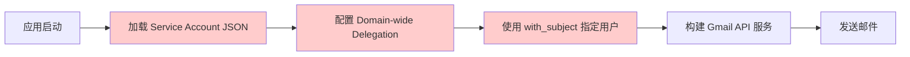
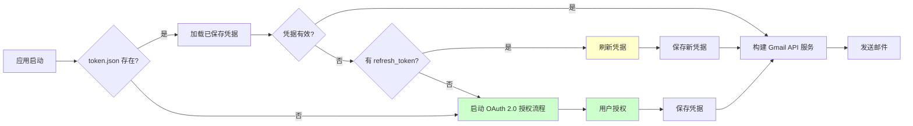

# CURSOR_WORK_25_11_13.md

## 2025-11-13 09:44 - 实现 Resend 邮件发送器

### 需求描述

在 `mail_manager/senders` 目录下实现一个新的邮件发送器，用于支持 Resend 服务。Resend 是一个现代化的邮件发送服务，提供简洁的 API 接口。

### 实现逻辑

#### 1. 创建 Resend 发送器 (`mail_manager/senders/resend_sender.py`)

实现了 `ResendSender` 类，继承自 `EmailSender` 抽象基类：

**核心特性**：

- 使用 Resend API Key 进行认证
- 支持异步发送（通过 `asyncio.to_thread` 将同步 API 转换为异步）
- 支持 HTML 和纯文本内容
- 支持发件人和收件人姓名格式化
- 使用 `tenacity` 实现重试机制（最多 3 次，指数退避）

**关键实现点**：

1. **初始化方法** (`__init__`)：

   - 检查 `RESEND_API_KEY` 配置项是否存在
   - 设置 `resend.api_key` 全局变量
   - 记录初始化日志

2. **参数构建方法** (`_build_send_params`)：

   - 格式化发件人地址：`"Name <email@example.com>"` 或 `"email@example.com"`
   - 格式化收件人地址（支持姓名）
   - 构建 Resend API 所需的参数字典
   - 可选添加纯文本内容

3. **发送方法** (`send_email`)：
   - 使用 `@retry` 装饰器实现自动重试
   - 通过 `asyncio.to_thread` 将同步的 Resend API 调用转换为异步
   - 智能处理返回值（支持字典和对象两种格式）
   - 提取消息 ID 并返回
   - 完整的异常处理和日志记录

**返回值处理逻辑**：

```python
# 支持多种返回值格式
if isinstance(email, dict):
    message_id = email.get("id") or email.get("message_id")
else:
    message_id = getattr(email, "id", None) or getattr(email, "message_id", None)
```

#### 2. 更新工厂函数 (`mail_manager/senders/factory.py`)

在 `create_email_sender` 函数中添加了 `resend` 类型的支持：

```python
elif sender_type == "resend":
    logger.info("创建 Resend 发送器实例")
    return ResendSender()
```

**使用方式**：

- 通过环境变量 `EMAIL_SENDER_TYPE=resend` 设置
- 或在代码中显式指定：`create_email_sender("resend")`

#### 3. 更新模块导出 (`mail_manager/senders/__init__.py`)

添加了 `ResendSender` 的导出：

```python
from .resend_sender import ResendSender
__all__ = ["GmailSender", "ResendSender"]
```

#### 4. 更新配置管理 (`config.py`)

在 `Settings` 类中添加了 `RESEND_API_KEY` 配置项：

```python
RESEND_API_KEY: str = ""  # Resend API Key（Resend 发送器使用）
```

同时更新了 `EMAIL_SENDER_TYPE` 的注释，说明支持 `resend` 类型。

### 架构设计

```
mail_manager/senders/
├── __init__.py          # 导出 GmailSender 和 ResendSender
├── factory.py           # 工厂函数，支持创建 gmail/resend/smtp 发送器
├── gmail_sender.py      # Gmail API 发送器实现
└── resend_sender.py     # Resend API 发送器实现（新增）
```

**设计模式**：

- **工厂模式**：通过 `create_email_sender()` 统一创建发送器实例
- **策略模式**：不同的发送器实现相同的 `EmailSender` 接口
- **异步适配**：将同步的 Resend API 通过 `asyncio.to_thread` 转换为异步

### 使用示例

#### 1. 环境变量配置 (`.env`)

```env
# 邮件发送器类型
EMAIL_SENDER_TYPE=resend

# Resend API Key
RESEND_API_KEY=re_xxxxxxxxxxxxx
```

#### 2. 代码中使用

```python
from mail_manager.senders.factory import create_email_sender

# 创建 Resend 发送器
sender = create_email_sender("resend")

# 发送邮件
message_id = await sender.send_email(
    to_email="recipient@example.com",
    to_name="Recipient Name",
    from_email="sender@example.com",
    from_name="Sender Name",
    subject="Hello World",
    html_content="<h1>Hello World</h1>",
    text_content="Hello World"  # 可选
)
```

### 技术细节

1. **异步处理**：

   - Resend Python SDK 是同步的，使用 `asyncio.to_thread` 在后台线程中执行
   - 与 FastAPI 的异步架构保持一致

2. **错误处理**：

   - 捕获所有异常并转换为 `EmailSendException`
   - 记录详细的错误日志
   - 支持重试机制（最多 3 次，指数退避）

3. **兼容性**：
   - 完全兼容现有的 `EmailSender` 接口
   - 返回值格式与 Gmail 发送器保持一致（返回 message_id 字符串）

### 依赖项

Resend Python SDK 已在 `pyproject.toml` 中配置：

```toml
resend>=2.19.0
```

### 测试建议

1. **单元测试**：Mock Resend API 调用，测试参数构建和错误处理
2. **集成测试**：使用真实的 Resend API Key 测试发送功能
3. **异常测试**：测试 API Key 无效、网络错误等场景

### 后续优化建议

1. **批量发送**：如果 Resend 支持批量发送，可以实现批量接口
2. **Webhook 支持**：集成 Resend 的 Webhook 以跟踪邮件状态
3. **模板支持**：如果 Resend 支持邮件模板，可以添加模板功能

---

## 2025-11-13 10:31 - 将 Gmail 发送器从 Service Account 改为 OAuth 2.0 用户授权

### 需求描述

将 Gmail 发送器的认证方式从 Google Workspace 的 Service Account + Domain-wide Delegation 改为标准的 Gmail API OAuth 2.0 用户授权方式。这样可以支持个人 Gmail 账户和标准的 OAuth 2.0 授权流程。

### 实现逻辑

#### 1. 修改 Gmail 发送器认证方式 (`mail_manager/senders/gmail_sender.py`)

**核心变更**：

- **移除**：Service Account 认证方式（`google.oauth2.service_account`）
- **新增**：OAuth 2.0 用户授权方式（`google.oauth2.credentials.Credentials`）
- **新增**：凭据自动刷新机制
- **新增**：首次授权流程支持

**关键实现点**：

1. **凭据管理方法** (`_get_credentials`)：

   - 自动加载已保存的 `token.json` 文件
   - 如果凭据过期，自动使用 `refresh_token` 刷新
   - 如果凭据不存在或刷新失败，启动 OAuth 2.0 授权流程
   - 授权成功后自动保存凭据到 `token.json`

2. **授权流程**：

   ```python
   # 使用 InstalledAppFlow 进行 OAuth 2.0 授权
   flow = InstalledAppFlow.from_client_secrets_file(
       settings.GOOGLE_OAUTH2_CREDENTIALS_FILE, SCOPES
   )
   # 在本地服务器上运行授权流程（自动打开浏览器）
   creds = flow.run_local_server(port=0)
   ```

3. **凭据刷新机制**：

   ```python
   # 如果凭据过期且有 refresh_token，自动刷新
   if creds and creds.expired and creds.refresh_token:
       creds.refresh(Request())
   ```

**OAuth 2.0 作用域**：

```python
SCOPES = ["https://www.googleapis.com/auth/gmail.send"]
```

#### 2. 更新配置管理 (`config.py`)

**移除的配置项**：

- `GOOGLE_SERVICE_ACCOUNT_FILE`：Service Account JSON 文件路径
- `GOOGLE_WORKSPACE_USER_EMAIL`：Google Workspace 用户邮箱
- `GOOGLE_WORKSPACE_DOMAIN`：Google Workspace 域名

**新增的配置项**：

- `GOOGLE_OAUTH2_CREDENTIALS_FILE`：OAuth 2.0 客户端凭据文件路径（`credentials.json`）
- `GOOGLE_OAUTH2_TOKEN_FILE`：OAuth 2.0 令牌文件路径（`token.json`）

### 架构对比

#### 之前的实现（Service Account + Domain-wide Delegation）



**特点**：

- 需要 Google Workspace 管理员配置
- 需要 Service Account 和 Domain-wide Delegation
- 适用于企业级批量发送场景

#### 现在的实现（OAuth 2.0 用户授权）



**特点**：

- 支持个人 Gmail 账户
- 标准的 OAuth 2.0 授权流程
- 自动刷新过期凭据
- 首次授权需要用户交互（打开浏览器）

### 使用方式

#### 1. 获取 OAuth 2.0 凭据文件

1. 访问 [Google Cloud Console](https://console.cloud.google.com/)
2. 创建或选择项目
3. 启用 Gmail API
4. 创建 OAuth 2.0 客户端 ID（应用类型：桌面应用）
5. 下载凭据文件，保存为 `credentials.json`

#### 2. 环境变量配置 (`.env`)

```env
# Gmail API OAuth 2.0 配置
GOOGLE_OAUTH2_CREDENTIALS_FILE=/path/to/credentials.json
GOOGLE_OAUTH2_TOKEN_FILE=/path/to/token.json
```

#### 3. 首次授权流程

首次运行时，应用会：

1. 检测到 `token.json` 不存在
2. 自动启动本地服务器
3. 打开浏览器进行授权
4. 用户授权后，自动保存 `token.json`
5. 后续运行自动使用保存的凭据

#### 4. 凭据自动刷新

- 如果 `token.json` 中的 `access_token` 过期，应用会自动使用 `refresh_token` 刷新
- 刷新后的新凭据会自动保存到 `token.json`
- 无需用户再次授权（除非 `refresh_token` 也过期）

### 技术细节

1. **异步兼容性**：

   - OAuth 2.0 授权流程是同步的，但不会阻塞异步操作
   - 授权只在初始化时执行一次
   - 后续的邮件发送仍然是异步的

2. **安全性**：

   - `token.json` 包含敏感的 `access_token` 和 `refresh_token`
   - 建议将 `token.json` 添加到 `.gitignore`
   - 生产环境建议使用更安全的凭据存储方式（如密钥管理服务）

3. **错误处理**：
   - 完整的异常处理和日志记录
   - 凭据加载失败时提供清晰的错误信息
   - 授权流程失败时给出明确的提示

### 依赖项

所需的依赖已在 `pyproject.toml` 中配置：

```toml
google-api-python-client>=2.0.0
google-auth>=2.0.0
google-auth-oauthlib>=1.2.2
google-auth-httplib2>=0.2.1
```

### 迁移指南

**从 Service Account 迁移到 OAuth 2.0**：

1. 移除旧的配置项：

   ```env
   # 删除这些配置
   # GOOGLE_SERVICE_ACCOUNT_FILE=
   # GOOGLE_WORKSPACE_USER_EMAIL=
   # GOOGLE_WORKSPACE_DOMAIN=
   ```

2. 添加新的配置项：

   ```env
   GOOGLE_OAUTH2_CREDENTIALS_FILE=/path/to/credentials.json
   GOOGLE_OAUTH2_TOKEN_FILE=/path/to/token.json
   ```

3. 获取 OAuth 2.0 凭据文件（见"使用方式"部分）

4. 首次运行进行授权

### 优势

1. **更通用**：支持个人 Gmail 账户，不限于 Google Workspace
2. **更标准**：使用标准的 OAuth 2.0 流程，符合 Google API 最佳实践
3. **更灵活**：可以轻松切换不同的 Gmail 账户
4. **自动刷新**：凭据过期时自动刷新，无需手动干预

### 注意事项

1. **首次授权**：首次运行需要用户交互（打开浏览器授权）
2. **token.json 安全**：确保 `token.json` 文件安全，不要提交到版本控制
3. **refresh_token 过期**：如果 `refresh_token` 过期，需要重新授权
4. **服务器环境**：在生产服务器上首次授权可能需要特殊处理（如使用无头浏览器或手动获取 token）
