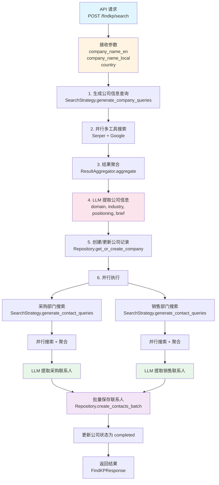
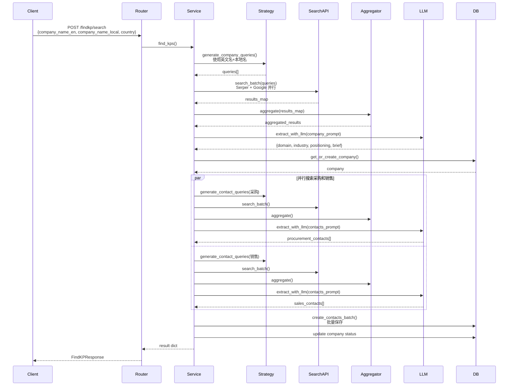

# FindKP 业务逻辑文档

本文档详细阐述 FindKP 模块的业务逻辑、数据流向、核心组件和实现细节。

## 目录

- [业务概述](#业务概述)
- [核心流程](#核心流程)
- [数据流向](#数据流向)
- [核心组件](#核心组件)
- [数据结构](#数据结构)
- [搜索策略](#搜索策略)
- [LLM 提取](#llm-提取)
- [错误处理](#错误处理)
- [性能优化](#性能优化)

## 业务概述

FindKP（Find Key Person）模块是 Smart Lead Agent 的核心功能模块之一，负责自动搜索目标公司的关键联系人信息，包括：

1. **公司基本信息**：域名、行业、定位、简介
2. **采购部门联系人**：采购经理、采购总监等关键决策人
3. **销售部门联系人**：销售经理、业务发展经理等

### 业务价值

- **自动化线索发现**：替代人工搜索，提升效率
- **多源数据聚合**：整合 Serper 和 Google 搜索结果
- **智能信息提取**：使用 LLM 从非结构化数据中提取结构化信息
- **本地化支持**：支持本地名称搜索，提升非英语国家公司搜索效果

## 核心流程

### 整体流程图



### 详细步骤说明

#### 步骤 1: 接收请求

**入口**: `findkp/router.py` → `find_kp()` 端点

**输入参数**:

- `company_name_en`: 公司英文名称（必需）
- `company_name_local`: 公司本地名称（必需）
- `country`: 国家名称（可选）

**示例**:

```json
{
  "company_name_en": "Apple Inc.",
  "company_name_local": "苹果公司",
  "country": "USA"
}
```

#### 步骤 2-4: 搜索公司基本信息

**流程**:

1. **生成查询**: `SearchStrategy.generate_company_queries()`

   - 使用英文名生成查询：`"Apple Inc. official website USA"`
   - 使用本地名生成查询：`"苹果公司 official website USA"`（如果不同）
   - 组合查询：`"Apple Inc. 苹果公司 official website USA"`
   - 本地化变体：`"苹果公司 company website USA"`

2. **并行搜索**: `Service._search_with_multiple_providers()`

   - Serper API 批量搜索
   - Google Custom Search API 批量搜索
   - 使用 `asyncio.gather()` 并行执行

3. **结果聚合**: `ResultAggregator.aggregate()`

   - 合并多个查询的结果
   - URL 去重
   - 标题相似度去重
   - 按相关性排序

4. **LLM 提取**: `Service.extract_with_llm()`
   - 使用 `EXTRACT_COMPANY_INFO_PROMPT`
   - 提取：域名、行业、定位、简介
   - 返回 JSON 格式的结构化数据

#### 步骤 5: 创建公司记录

**操作**: `Repository.get_or_create_company()`

**保存字段**:

- `name`: 公司英文名称
- `domain`: 公司域名
- `industry`: 行业
- `positioning`: 公司定位描述
- `brief`: 公司简要介绍
- `status`: 设置为 `processing`

#### 步骤 6-9: 并行搜索联系人

**流程**:

1. **并行执行**: 采购和销售搜索同时进行

   ```python
   procurement_task = self._search_contacts_parallel(...)
   sales_task = self._search_contacts_parallel(...)
   await asyncio.gather(procurement_task, sales_task)
   ```

2. **每个部门的搜索流程**:

   - 生成查询（使用英文名和本地名）
   - 并行搜索（Serper + Google）
   - 结果聚合
   - LLM 提取联系人信息

3. **联系人信息字段**:
   - `full_name`: 姓名
   - `email`: 邮箱
   - `role`: 职位
   - `department`: 部门（采购/销售）
   - `linkedin_url`: LinkedIn URL
   - `twitter_url`: Twitter/X URL
   - `confidence_score`: 置信度（0-1）
   - `source`: 信息来源

#### 步骤 10: 批量保存联系人

**操作**: `Repository.create_contacts_batch()`

**优化**:

- 收集所有联系人后一次性批量保存
- 使用事务批量提交，减少数据库往返
- 如果批量保存失败，降级为单个保存模式

#### 步骤 11: 更新状态

**操作**: 将公司状态更新为 `completed`

## 数据流向

### 数据流转图



### 数据格式

#### 输入数据（CompanyQuery）

```python
{
    "company_name_en": "Apple Inc.",
    "company_name_local": "苹果公司",
    "country": "USA"  # 可选
}
```

#### 输出数据（FindKPResponse）

```python
{
    "success": True,
    "company_id": 123,
    "company_domain": "apple.com",
    "contacts": [
        {
            "full_name": "John Doe",
            "email": "john.doe@apple.com",
            "role": "Procurement Manager",
            "department": "采购",
            "linkedin_url": "https://linkedin.com/in/johndoe",
            "confidence_score": 0.85,
            "source": "https://example.com"
        }
    ],
    "message": "成功找到 8 个联系人"
}
```

## 核心组件

### 1. SearchStrategy（搜索策略）

**文件**: `findkp/search_strategy.py`

**职责**:

- 生成优化的搜索查询
- 利用公司名和国家信息提升搜索效果
- 支持英文名和本地名组合查询

**核心方法**:

1. **`generate_company_queries()`**

   - 生成公司信息搜索查询
   - 支持多个查询变体（英文名、本地名、组合查询）
   - 根据国家设置 `gl`、`hl`、`location` 参数

2. **`generate_contact_queries()`**
   - 生成联系人搜索查询
   - 根据部门（采购/销售）生成不同查询模板
   - 支持英文名和本地名双重查询

**查询生成策略**:

- **公司信息查询**:

  - 基础：`{company_name_en} official website`
  - 本地：`{company_name_local} official website`（如果不同）
  - 组合：`{company_name_en} {company_name_local} official website`
  - 变体：`{company_name_local} company website`

- **联系人查询**:
  - 采购：`{company_name} procurement manager`, `{company_name} purchasing manager` 等
  - 销售：`{company_name} sales manager`, `{company_name} sales director` 等
  - 每个模板都会生成英文名和本地名两个版本（如果不同）

### 2. ResultAggregator（结果聚合器）

**文件**: `findkp/result_aggregator.py`

**职责**:

- 合并多个搜索工具的结果
- 去重和排序

**去重策略**:

1. **URL 完全匹配去重**

   - 标准化 URL（转小写、去除尾部斜杠）
   - 使用 Set 快速查找重复

2. **标题相似度去重**
   - 检查标题是否被另一个标题包含
   - 如果相似，保留 snippet 更长的版本

**排序策略**:

- 当前保持原始顺序（Serper 结果在前，Google 结果在后）
- 未来可优化：根据关键词匹配度、snippet 质量等排序

### 3. FindKPService（业务服务）

**文件**: `findkp/service.py`

**职责**:

- 协调整个 FindKP 流程
- 调用搜索、聚合、LLM 提取
- 管理数据库操作

**核心方法**:

1. **`find_kps()`**: 主流程方法
2. **`_search_with_multiple_providers()`**: 多工具并行搜索
3. **`_search_contacts_parallel()`**: 并行搜索联系人（采购/销售）
4. **`extract_with_llm()`**: LLM 信息提取

### 4. Repository（数据访问层）

**文件**: `database/repository.py`

**职责**:

- 封装数据库 CRUD 操作
- 提供批量操作方法

**核心方法**:

- `get_or_create_company()`: 获取或创建公司记录
- `create_contact()`: 创建单个联系人
- `create_contacts_batch()`: 批量创建联系人

## 数据结构

### Company（公司表）

```sql
CREATE TABLE companies (
    id INT PRIMARY KEY AUTO_INCREMENT,
    name VARCHAR(255) UNIQUE NOT NULL,        -- 公司名称（英文）
    domain VARCHAR(255),                       -- 公司域名
    industry VARCHAR(100),                    -- 行业
    positioning TEXT,                         -- 公司定位描述
    brief TEXT,                               -- 公司简要介绍
    status ENUM('pending', 'processing', 'completed', 'failed'),
    created_at TIMESTAMP,
    updated_at TIMESTAMP
);
```

### Contact（联系人表）

```sql
CREATE TABLE contacts (
    id INT PRIMARY KEY AUTO_INCREMENT,
    company_id INT NOT NULL,                  -- 关联公司ID
    full_name VARCHAR(255),                   -- 联系人全名
    email VARCHAR(255) NOT NULL,             -- 邮箱
    role VARCHAR(255),                       -- 职位
    department VARCHAR(100),                 -- 部门（采购/销售）
    linkedin_url VARCHAR(512),               -- LinkedIn URL
    twitter_url VARCHAR(512),                -- Twitter/X URL
    phone VARCHAR(50),                       -- 电话
    source VARCHAR(1024),                    -- 信息来源
    confidence_score DECIMAL(3,2),           -- 置信度（0-1）
    created_at TIMESTAMP,
    updated_at TIMESTAMP,
    FOREIGN KEY (company_id) REFERENCES companies(id)
);
```

## 搜索策略

### 多源搜索

**搜索提供者**:

- **Serper.dev**: 专业的 Google 搜索 API，支持批量查询
- **Google Custom Search**: Google 官方 API，支持自定义搜索

**并行策略**:

- 两个搜索工具同时执行
- 使用 `asyncio.gather()` 并行
- 单个工具失败不影响整体流程

### 查询优化

**国家参数**:

- `gl`: 国家代码（如 "vn" 表示越南）
- `hl`: 语言代码（如 "vi" 表示越南语）
- `location`: 位置信息（如 "Vietnam"）

**查询多样性**:

- 使用英文名和本地名生成多个查询变体
- 增加搜索结果覆盖率
- 特别适用于非英语国家公司

## LLM 提取

### Prompt 设计

#### 公司信息提取 Prompt

**文件**: `findkp/prompts.py` → `EXTRACT_COMPANY_INFO_PROMPT`

**提取字段**:

- `domain`: 公司域名
- `industry`: 行业
- `positioning`: 公司定位描述（200 字以内）
- `brief`: 公司简要介绍（300 字以内）

**要求**:

- 基于搜索结果中的实际信息
- 不要编造信息
- 使用简洁清晰的语言

#### 联系人提取 Prompt

**文件**: `findkp/prompts.py` → `EXTRACT_CONTACTS_PROMPT`

**提取字段**:

- `full_name`: 姓名
- `email`: 邮箱
- `role`: 职位
- `linkedin_url`: LinkedIn URL
- `twitter_url`: Twitter/X URL
- `confidence_score`: 置信度（0-1）

**要求**:

- 只提取真实有效的邮箱地址
- 避免通用邮箱（contact@, info@, sales@）
- 优先提取与指定国家相关的联系人信息

### LLM 调用

**方式**: 使用 LangChain V1 的异步 API

```python
response = await self.llm.ainvoke([{"role": "user", "content": prompt}])
result = json.loads(response.content)
```

**错误处理**:

- JSON 解析失败：记录错误日志，返回空字典/列表
- LLM 调用失败：记录错误日志，返回空结果

## 错误处理

### 分层错误处理

1. **搜索层**:

   - 单个搜索工具失败：记录警告，继续使用其他工具
   - 所有搜索工具失败：返回空结果，继续后续流程

2. **LLM 提取层**:

   - JSON 解析失败：记录错误，返回空结果
   - LLM 调用失败：记录错误，返回空结果

3. **数据保存层**:
   - 批量保存失败：降级为单个保存模式
   - 单个联系人保存失败：记录错误，继续保存其他联系人

### 状态管理

**公司状态流转**:

```
pending → processing → completed/failed
```

- `pending`: 初始状态
- `processing`: 正在处理
- `completed`: 处理完成
- `failed`: 处理失败

## 性能优化

### 并行执行

1. **搜索工具并行**: Serper 和 Google 同时执行
2. **部门搜索并行**: 采购和销售搜索同时执行
3. **批量操作**: 联系人批量保存，减少数据库往返

### 预期性能提升

- **并行搜索**: 减少约 50% 的搜索时间
- **批量保存**: 减少数据库操作次数，提升保存效率
- **多查询变体**: 增加搜索结果覆盖率，提升信息质量

### 优化建议

1. **缓存机制**: 可以缓存已搜索过的公司信息
2. **增量更新**: 支持增量更新联系人信息
3. **异步处理**: 对于大批量任务，可以使用异步队列处理

## 使用示例

### API 调用示例

```bash
curl -X POST "http://localhost:8000/findkp/search" \
  -H "Content-Type: application/json" \
  -d '{
    "company_name_en": "Apple Inc.",
    "company_name_local": "苹果公司",
    "country": "USA"
  }'
```

### CLI 调用示例

```bash
smart-lead findkp \
  --company-name-en "Apple Inc." \
  --company-name-local "苹果公司" \
  --country "USA" \
  --verbose
```

## 扩展方向

1. **更多搜索源**: 集成更多搜索 API（如 Bing、DuckDuckGo）
2. **智能去重**: 使用更复杂的相似度算法（如编辑距离）
3. **增量更新**: 支持定期更新联系人信息
4. **数据验证**: 添加邮箱验证、LinkedIn 信息验证
5. **导出功能**: 支持导出联系人信息到 CSV、Excel 等格式
