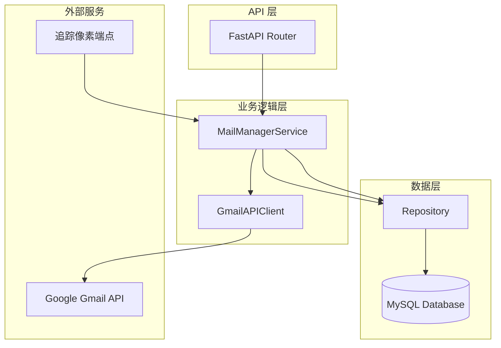
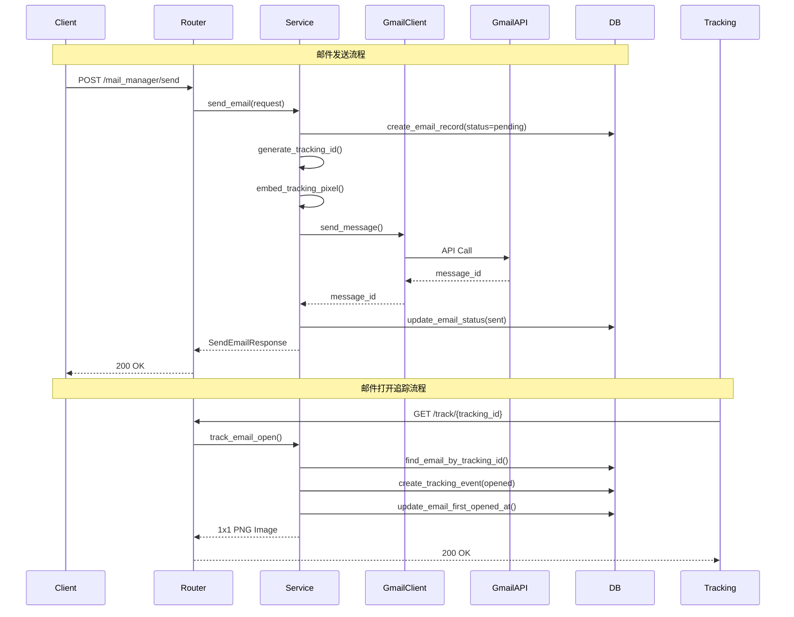
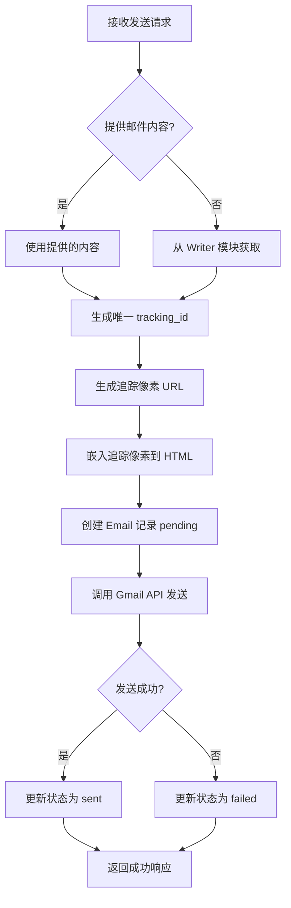

# MailManager 模块完整架构设计

## 📋 目录
1. [系统概述](#系统概述)
2. [架构设计](#架构设计)
3. [数据模型](#数据模型)
4. [API 设计](#api-设计)
5. [核心流程](#核心流程)
6. [技术实现](#技术实现)
7. [配置说明](#配置说明)
8. [实现检查清单](#实现检查清单)

## 系统概述

MailManager 模块是 Smart Lead Agent 项目的邮件发送和追踪子系统，负责：
- ✅ 通过 Google Workspace Gmail API 发送邮件
- ✅ 记录邮件发送情况（收件人、发件人、时间）
- ✅ 追踪邮件是否被打开（追踪像素技术）

## 架构设计

### 模块结构

```
mail_manager/
├── __init__.py          # 模块初始化
├── router.py            # FastAPI 路由（API 端点）
├── service.py           # 业务逻辑服务层
├── gmail_client.py      # Gmail API 客户端封装
└── utils.py             # 工具函数（追踪像素生成等）

schemas/
└── mail_manager.py      # Pydantic 数据模型（请求/响应）

database/
├── models.py            # 新增 Email, EmailTracking ORM 模型
└── repository.py         # 扩展邮件相关仓储方法
```

### 系统架构图



### 数据流图



## 数据模型

### Email 表（邮件记录）

| 字段 | 类型 | 说明 |
|------|------|------|
| id | Integer | 主键 |
| contact_id | Integer | 关联联系人（可选） |
| company_id | Integer | 关联公司（可选） |
| subject | String(512) | 邮件主题 |
| html_content | Text | HTML 内容（已嵌入追踪像素） |
| text_content | Text | 纯文本内容（可选） |
| to_email | String(255) | 收件人邮箱 |
| to_name | String(255) | 收件人姓名 |
| from_email | String(255) | 发件人邮箱 |
| from_name | String(255) | 发件人姓名 |
| tracking_id | String(64) | 唯一追踪ID（索引） |
| tracking_pixel_url | String(512) | 追踪像素URL |
| status | Enum | 状态：pending/sending/sent/failed/bounced |
| gmail_message_id | String(255) | Gmail API 返回的消息ID |
| error_message | Text | 错误信息 |
| created_at | TIMESTAMP | 创建时间 |
| sent_at | TIMESTAMP | 发送时间 |
| first_opened_at | TIMESTAMP | 首次打开时间 |
| updated_at | TIMESTAMP | 更新时间 |

### EmailTracking 表（追踪事件）

| 字段 | 类型 | 说明 |
|------|------|------|
| id | Integer | 主键 |
| email_id | Integer | 关联邮件ID（外键） |
| event_type | Enum | 事件类型：opened/clicked/replied |
| ip_address | String(45) | IP 地址 |
| user_agent | String(512) | 浏览器 User-Agent |
| referer | String(512) | 来源页面 |
| created_at | TIMESTAMP | 事件时间 |

## API 设计

### 1. 发送单封邮件

**POST** `/mail_manager/send`

**请求体：**
```json
{
  "to_email": "recipient@example.com",
  "to_name": "John Doe",
  "subject": "邮件主题",
  "html_content": "<html>...</html>",
  "contact_id": 123,  // 可选：从 Writer 模块获取内容
  "from_email": "noreply@yourdomain.com",  // 可选
  "from_name": "Your Company"  // 可选
}
```

**响应：**
```json
{
  "success": true,
  "message": "邮件发送成功",
  "email_id": 1,
  "tracking_id": "uuid-here",
  "status": "sent",
  "gmail_message_id": "gmail-id",
  "sent_at": "2024-01-01T12:00:00Z"
}
```

### 2. 批量发送邮件

**POST** `/mail_manager/send_batch`

**请求体：**
```json
{
  "emails": [
    {"to_email": "user1@example.com", "subject": "...", "html_content": "..."},
    {"to_email": "user2@example.com", "subject": "...", "html_content": "..."}
  ],
  "rate_limit": 10  // 可选：覆盖全局配置
}
```

### 3. 追踪像素端点

**GET** `/mail_manager/track/{tracking_id}`

- 返回 1x1 透明 PNG 图片
- 自动记录打开事件

### 4. 查询邮件状态

**GET** `/mail_manager/emails/{email_id}`

**响应：**
```json
{
  "success": true,
  "email_id": 1,
  "status": "sent",
  "to_email": "recipient@example.com",
  "subject": "邮件主题",
  "sent_at": "2024-01-01T12:00:00Z",
  "first_opened_at": "2024-01-01T13:00:00Z",
  "open_count": 3,
  "tracking_events": [...]
}
```

### 5. 查询邮件列表

**GET** `/mail_manager/emails?status=sent&limit=10&offset=0`

## 核心流程

### 邮件发送流程



### 邮件追踪流程

```mermaid
flowchart TD
    A[收件人打开邮件] --> B[邮件客户端加载图片]
    B --> C[请求追踪像素 URL]
    C --> D[GET /track/{tracking_id}]
    D --> E[查找邮件记录]
    E --> F[创建 EmailTracking 事件]
    F --> G{首次打开?}
    G -->|是| H[更新 first_opened_at]
    G -->|否| I[仅记录事件]
    H --> J[返回 1x1 PNG]
    I --> J
```

## 技术实现

### 1. Gmail API 客户端

**技术栈：**
- `google-api-python-client`: Gmail API 官方客户端
- `google-auth`: OAuth 2.0 认证
- Service Account + Domain-wide Delegation

**核心方法：**
```python
class GmailAPIClient:
    async def send_message(
        to: str,
        subject: str,
        html_content: str,
        from_email: str
    ) -> str:
        """发送邮件，返回 Gmail message_id"""
```

### 2. 追踪像素实现

**生成追踪 URL：**
```python
tracking_url = f"{TRACKING_BASE_URL}/mail_manager/track/{tracking_id}"
```

**嵌入到 HTML：**
```html

```

**追踪端点：**
- 快速响应（<100ms）
- 记录 IP、User-Agent、时间
- 返回 1x1 透明 PNG

### 3. 速率控制

**实现方式：**
- 使用 `asyncio.Semaphore` 控制并发
- 批量发送时限制每分钟发送数量
- 支持每日发送上限检查

### 4. 错误处理

**重试机制：**
- Gmail API 错误：使用 `tenacity` 实现指数退避重试
- 数据库错误：事务回滚
- 追踪端点：快速失败，不影响响应

## 配置说明

### 环境变量配置

已在 `.env.example` 中添加以下配置：

```bash
# Google Workspace 配置
GOOGLE_SERVICE_ACCOUNT_FILE=/path/to/service-account.json
GOOGLE_WORKSPACE_USER_EMAIL=noreply@yourdomain.com
GOOGLE_WORKSPACE_DOMAIN=yourdomain.com

# 追踪配置
TRACKING_BASE_URL=https://yourdomain.com
TRACKING_ENABLED=true

# 速率限制
EMAIL_SEND_RATE_LIMIT=10
EMAIL_DAILY_LIMIT=2000
```

### config.py 配置类

需要在 `config.py` 的 `Settings` 类中添加相应字段。

## 实现检查清单

### Phase 1: 基础框架 ✅
- [ ] 更新 `.env.example` 添加配置项
- [ ] 更新 `config.py` 添加配置字段
- [ ] 创建数据库模型（Email, EmailTracking）
- [ ] 创建数据库迁移脚本
- [ ] 扩展 Repository 添加邮件相关方法

### Phase 2: Gmail API 客户端 ✅
- [ ] 创建 `mail_manager/gmail_client.py`
- [ ] 实现 Service Account 认证
- [ ] 实现异步发送方法
- [ ] 实现错误处理和重试

### Phase 3: 服务层实现 ✅
- [ ] 创建 `mail_manager/service.py`
- [ ] 实现 `send_email()` 方法
- [ ] 实现 `send_batch()` 方法
- [ ] 实现 `track_email_open()` 方法
- [ ] 实现追踪像素生成和嵌入

### Phase 4: API 路由 ✅
- [ ] 创建 `mail_manager/router.py`
- [ ] 创建 `schemas/mail_manager.py`
- [ ] 实现 POST `/mail_manager/send`
- [ ] 实现 POST `/mail_manager/send_batch`
- [ ] 实现 GET `/mail_manager/track/{tracking_id}`
- [ ] 实现 GET `/mail_manager/emails/{email_id}`
- [ ] 实现 GET `/mail_manager/emails`

### Phase 5: 集成和测试 ✅
- [ ] 在 `main.py` 注册路由
- [ ] 测试单封邮件发送
- [ ] 测试批量发送
- [ ] 测试追踪功能
- [ ] 测试错误处理

### Phase 6: 优化和完善 ✅
- [ ] 实现速率限制控制
- [ ] 优化追踪端点性能
- [ ] 添加日志记录
- [ ] 添加监控指标

## 依赖项

需要在 `pyproject.toml` 中添加：

```toml
google-api-python-client = ">=2.0.0"
google-auth = ">=2.0.0"
tenacity = ">=8.0.0"
Pillow = ">=10.0.0"  # 可选：用于生成追踪像素
```

## 安全考虑

1. **认证安全**
   - Service Account JSON 文件安全存储
   - 不在代码中硬编码凭据
   - 使用环境变量管理配置

2. **追踪隐私**
   - 符合 GDPR/CCPA 要求
   - 提供隐私政策说明
   - 考虑提供取消追踪选项

3. **API 安全**
   - 追踪端点防滥用（可选：签名验证）
   - 速率限制防止恶意请求

## 性能优化建议

1. **异步处理**：所有 I/O 操作使用 async/await
2. **批量操作**：批量插入追踪事件
3. **缓存机制**：追踪端点使用缓存减少数据库查询
4. **连接池**：Gmail API 客户端使用连接池

## 未来扩展

1. **点击追踪**：为邮件中的链接添加追踪参数
2. **回复检测**：使用 Gmail API 检测邮件回复
3. **统计分析**：提供邮件发送和打开统计报表
4. **A/B 测试**：支持邮件内容 A/B 测试

---

**设计完成时间：** 2024-11-12  
**设计者：** AI Architect  
**状态：** ✅ 设计完成，准备实现
