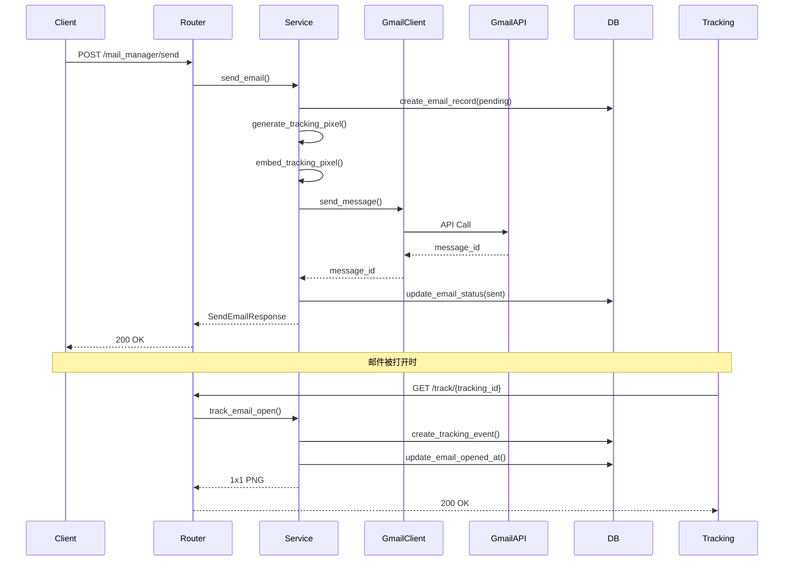

# MailManager 模块完整设计方案

## 一、概述

MailManager 模块负责邮件的发送、记录和追踪功能，使用 Google Workspace Gmail API 进行邮件发送，并通过追踪像素技术实现邮件打开检测。

## 二、架构设计

### 2.1 模块结构

```
mail_manager/
├── __init__.py          # 模块初始化
├── router.py            # FastAPI 路由定义
├── service.py           # 业务逻辑服务层
├── gmail_client.py      # Gmail API 客户端封装
└── utils.py             # 工具函数（追踪像素等）

schemas/
└── mail_manager.py      # Pydantic 数据模型

database/
├── models.py            # 新增 Email, EmailTracking 模型
└── repository.py        # 扩展邮件相关仓储方法
```

### 2.2 数据流图



## 三、配置管理

### 3.1 .env.example 新增配置

```bash
# Google Workspace Gmail API 配置
GOOGLE_SERVICE_ACCOUNT_FILE=/path/to/service-account.json
GOOGLE_WORKSPACE_USER_EMAIL=noreply@yourdomain.com
GOOGLE_WORKSPACE_DOMAIN=yourdomain.com

# 邮件追踪配置
TRACKING_BASE_URL=https://yourdomain.com
TRACKING_ENABLED=true

# 邮件发送配置
EMAIL_SEND_RATE_LIMIT=10
EMAIL_DAILY_LIMIT=2000
```

### 3.2 config.py 配置类

```python
# Google Workspace 配置
GOOGLE_SERVICE_ACCOUNT_FILE: str = ""
GOOGLE_WORKSPACE_USER_EMAIL: str = ""
GOOGLE_WORKSPACE_DOMAIN: str = ""

# 邮件追踪配置
TRACKING_BASE_URL: str = ""
TRACKING_ENABLED: bool = True

# 发送速率限制
EMAIL_SEND_RATE_LIMIT: int = 10  # 每分钟发送数量
EMAIL_DAILY_LIMIT: int = 2000     # 每日发送上限（0=无限制）
```

## 四、数据库设计

### 4.1 Email 模型

```python
class EmailStatus(enum.Enum):
    pending = "pending"      # 待发送
    sending = "sending"      # 发送中
    sent = "sent"           # 已发送
    failed = "failed"       # 发送失败
    bounced = "bounced"     # 退信

class Email(Base):
    __tablename__ = "emails"
    
    id = Column(Integer, primary_key=True)
    # 关联信息
    contact_id = Column(Integer, ForeignKey("contacts.id"), nullable=True)
    company_id = Column(Integer, ForeignKey("companies.id"), nullable=True)
    
    # 邮件基本信息
    subject = Column(String(512), nullable=False)
    html_content = Column(Text, nullable=False)
    text_content = Column(Text)
    
    # 收件人信息
    to_email = Column(String(255), nullable=False, index=True)
    to_name = Column(String(255))
    
    # 发件人信息
    from_email = Column(String(255), nullable=False)
    from_name = Column(String(255))
    
    # 追踪信息
    tracking_id = Column(String(64), unique=True, nullable=False, index=True)
    tracking_pixel_url = Column(String(512))
    
    # 状态信息
    status = Column(Enum(EmailStatus), default=EmailStatus.pending, index=True)
    gmail_message_id = Column(String(255), unique=True)
    error_message = Column(Text)
    
    # 时间戳
    created_at = Column(TIMESTAMP, server_default=func.now())
    sent_at = Column(TIMESTAMP)
    first_opened_at = Column(TIMESTAMP)  # 首次打开时间
    updated_at = Column(TIMESTAMP, server_default=func.now(), onupdate=func.current_timestamp())
    
    # 关系
    contact = relationship("Contact", backref="emails")
    company = relationship("Company", backref="emails")
    tracking_events = relationship("EmailTracking", back_populates="email")
```

### 4.2 EmailTracking 模型

```python
class EmailTrackingEventType(enum.Enum):
    opened = "opened"
    clicked = "clicked"
    replied = "replied"

class EmailTracking(Base):
    __tablename__ = "email_tracking"
    
    id = Column(Integer, primary_key=True)
    email_id = Column(Integer, ForeignKey("emails.id"), nullable=False, index=True)
    
    event_type = Column(Enum(EmailTrackingEventType), nullable=False, index=True)
    
    # 追踪信息
    ip_address = Column(String(45))
    user_agent = Column(String(512))
    referer = Column(String(512))
    
    created_at = Column(TIMESTAMP, server_default=func.now(), index=True)
    
    email = relationship("Email", back_populates="tracking_events")
```

## 五、API 接口设计

### 5.1 发送单封邮件

**POST /mail_manager/send**

请求：
```python
class SendEmailRequest(BaseModel):
    # 方式1: 直接提供邮件内容
    to_email: EmailStr
    to_name: Optional[str] = None
    subject: Optional[str] = None
    html_content: Optional[str] = None
    
    # 方式2: 从 Writer 模块获取（提供 contact_id）
    contact_id: Optional[int] = None
    company_id: Optional[int] = None
    
    # 发件人信息（可选，默认使用配置）
    from_email: Optional[str] = None
    from_name: Optional[str] = None
```

响应：
```python
class SendEmailResponse(BaseResponse):
    email_id: int
    tracking_id: str
    status: str
    gmail_message_id: Optional[str] = None
    sent_at: Optional[datetime] = None
```

### 5.2 批量发送邮件

**POST /mail_manager/send_batch**

请求：
```python
class SendBatchEmailRequest(BaseModel):
    emails: List[SendEmailRequest]
    rate_limit: Optional[int] = None  # 覆盖全局配置
```

响应：
```python
class SendBatchEmailResponse(BaseResponse):
    total: int
    success: int
    failed: int
    results: List[SendEmailResponse]
```

### 5.3 追踪像素端点

**GET /mail_manager/track/{tracking_id}**

- 返回 1x1 透明 PNG
- 记录打开事件
- 记录 IP、User-Agent 等信息

### 5.4 查询邮件状态

**GET /mail_manager/emails/{email_id}**

响应：
```python
class EmailStatusResponse(BaseResponse):
    email_id: int
    status: str
    to_email: str
    subject: str
    sent_at: Optional[datetime]
    first_opened_at: Optional[datetime]
    open_count: int
    tracking_events: List[EmailTrackingEvent]
```

### 5.5 查询邮件列表

**GET /mail_manager/emails?status=sent&limit=10&offset=0**

## 六、核心实现

### 6.1 Gmail API 客户端

```python
class GmailAPIClient:
    def __init__(self, credentials_path: str, user_email: str):
        # 初始化 Service Account 认证
        # 使用 Domain-wide Delegation
    
    async def send_message(
        self, 
        to: str, 
        subject: str, 
        html_content: str, 
        from_email: str
    ) -> str:
        # 发送邮件，返回 message_id
```

### 6.2 追踪像素生成

```python
def generate_tracking_pixel_url(tracking_id: str) -> str:
    """生成追踪像素 URL"""
    return f"{settings.TRACKING_BASE_URL}/mail_manager/track/{tracking_id}"

def embed_tracking_pixel(html_content: str, tracking_url: str) -> str:
    """在 HTML 中嵌入追踪像素"""
    pixel_html = f''
    # 在 </body> 之前插入
    return html_content.replace('</body>', f'{pixel_html}</body>')
```

### 6.3 服务层核心逻辑

```python
class MailManagerService:
    async def send_email(self, request: SendEmailRequest, db: AsyncSession):
        # 1. 获取邮件内容（从请求或 Writer 模块）
        # 2. 生成 tracking_id
        # 3. 生成追踪像素并嵌入
        # 4. 创建 Email 记录
        # 5. 调用 Gmail API 发送
        # 6. 更新状态
        # 7. 返回结果
    
    async def track_email_open(
        self, 
        tracking_id: str, 
        request: Request, 
        db: AsyncSession
    ):
        # 1. 查找邮件
        # 2. 创建追踪事件
        # 3. 更新首次打开时间
        # 4. 返回 PNG
```

## 七、实现步骤

### Phase 1: 基础框架
1. ✅ 更新 .env.example 和 config.py
2. ✅ 创建数据库模型（Email, EmailTracking）
3. ✅ 创建 Gmail API 客户端
4. ✅ 实现服务层基础方法
5. ✅ 实现路由和 API 端点

### Phase 2: 核心功能
1. ✅ 实现邮件发送功能
2. ✅ 实现追踪像素端点
3. ✅ 实现状态查询 API
4. ✅ 错误处理和重试

### Phase 3: 完善功能
1. ✅ 批量发送功能
2. ✅ 速率限制控制
3. ✅ 追踪数据统计
4. ✅ 性能优化

## 八、技术要点

### 8.1 异步处理
- 所有操作使用 async/await
- Gmail API 调用异步封装
- 数据库操作使用 AsyncSession

### 8.2 错误处理
- Gmail API 错误：重试机制（tenacity）
- 数据库错误：事务回滚
- 追踪端点：快速失败，不影响响应

### 8.3 速率控制
- 使用 asyncio.Semaphore 控制并发
- 支持批量发送的速率限制
- 每日发送上限检查

### 8.4 追踪优化
- 追踪端点快速响应（<100ms）
- 使用缓存减少数据库查询
- 批量插入追踪事件（可选）

## 九、安全考虑

1. **认证安全**：Service Account JSON 文件安全存储
2. **追踪隐私**：符合 GDPR/CCPA 要求
3. **API 安全**：追踪端点防滥用（可选：签名验证）
4. **数据安全**：敏感信息加密存储

## 十、依赖项

```toml
google-api-python-client>=2.0.0
google-auth>=2.0.0
tenacity>=8.0.0
Pillow>=10.0.0  # 用于生成追踪像素（可选）
```

