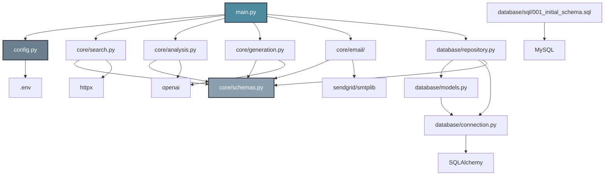
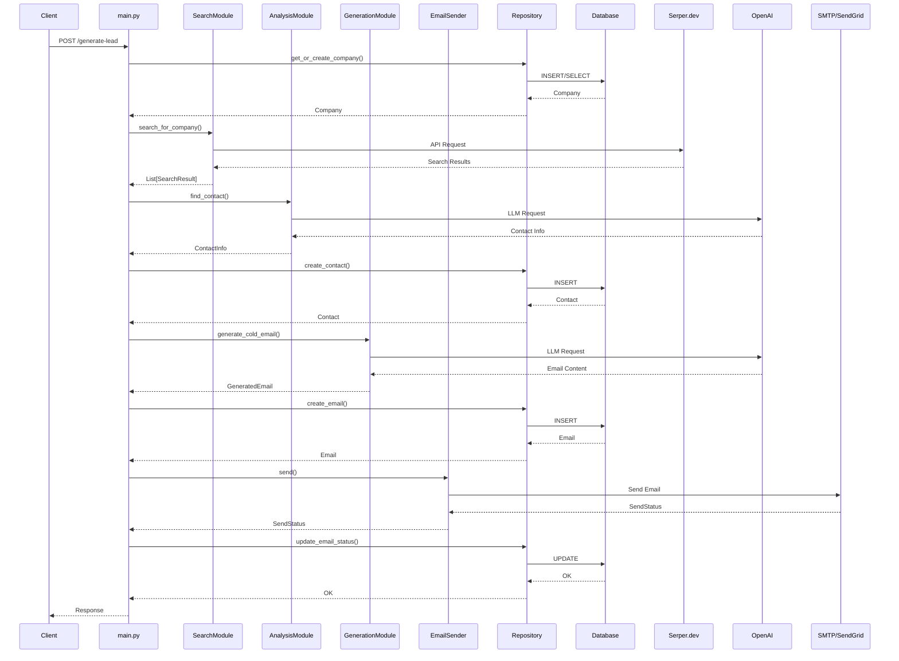

# Smart Lead Agent - 架构设计文档

## 1. 概览

本文档概述了 "智能销售代理" (Smart Lead Agent) 的系统架构。该系统旨在自动化潜在客户的开发流程，从初步的公司研究到发送个性化的外联邮件。

系统的主要目标是接收一个公司名称作为输入，然后自主地寻找相关的采购联系人，生成一封有说服力的邮件，发送并跟踪其表现。

此设计强调模块化和可扩展性，以便于未来的功能增强，例如集成像 LangGraph 这样的更复杂的代理工作流框架。

## 2. 系统架构

### 2.1. 架构模式

系统采用 **模块化、流水线式架构**。整个业务流程被分解为一系列独立的、单一职责的组件（模块）。一个中央协调器（Orchestrator）驱动数据流通过这个流水线，将一个模块的输出作为下一个模块的输入。

这种方法有几个优点：

- **可维护性:** 每个组件都可以独立开发、测试和维护。
- **灵活性:** 组件可以轻松地被替换或升级（例如，将一个搜索服务提供商更换为另一个）。
- **可扩展性:** 它为从简单的线性脚本迁移到复杂的基于图的工作流（例如 LangGraph）提供了清晰的路径。

### 2.2. 系统上下文图

下图说明了系统的边界及其与外部服务的交互。

```mermaid
graph TD
    subgraph 智能销售代理系统 (Smart Lead Agent)
        A[API 端点 (FastAPI)]
        B[搜索模块 (Search Module)]
        C[分析模块 (Analysis Module)]
        D[生成模块 (Generation Module)]
        E[邮件模块 (Email Module)]
        F[数据存储 (DataStore)]
    end

    subgraph 外部服务 (External Services)
        G[MySQL 数据库]
        H[Serper.dev API]
        I[LLM API]
        J[SMTP 服务]
        K[专业邮件服务商 API (ESP)]
    end

    A --> B
    B --> C
    C --> D
    D --> E

    B -- 执行搜索 --> H
    C -- 使用LLM进行提取 --> I
    D -- 使用LLM进行写作 --> I
    E -- 通过SMTP发送 --> J
    E -- 通过ESP发送 --> K

    F <--> A
    F <--> B
    F <--> C
    F <--> D
    F <--> E

    F -- 管理数据于 --> G

    style `智能销售代理系统 (Smart Lead Agent)` fill:#2b303a,stroke:#4f8b9f,stroke-width:2px,color:#fff
    style `外部服务 (External Services)` fill:#3a3f4b,stroke:#888,stroke-width:2px,color:#fff
```

## 3. 核心组件

- `Orchestrator`: 流程驱动器。系统将使用 **FastAPI** 框架，因此协调器将表现为一个或多个 API 端点（例如，在 `main.py` 中定义）。这些端点将接收请求并触发潜在客户的开发流程。
- `ConfigManager`: 管理所有外部配置，如 API 密钥和数据库凭据，从环境变量中安全加载。
- `SearchModule`: 负责信息搜集。它使用预定义的搜索策略来查询 `Serper.dev` API，并返回原始搜索结果。
- `AnalysisModule`: 处理原始搜索结果，以提取结构化的联系人信息（姓名、职位、邮箱、LinkedIn）。这可能涉及规则解析和 LLM 驱动的分析。
- `GenerationModule`: 生成个性化的邮件内容。它接收结构化的联系人信息，并使用 LLM 根据预定义模板生成一封有说服力的邮件。
- `EmailModule`: 用于发送邮件的统一接口。它抽象了不同发送机制的复杂性，支持标准 SMTP 和专业邮件服务提供商（ESP）。
- `DataStore`: 数据访问层。它为所有数据库操作（CRUD）提供一个清晰、高级的 API，抽象了底层的 SQL 查询和 ORM 模型。

## 4. 数据库模式 (Schema)

系统依赖一个 MySQL 数据库和四个核心表来管理工作流和跟踪结果。

### 4.1. `companies` (公司表)

存储目标公司及其总体处理状态。

- `id` (PK, INT, AUTO_INCREMENT)
- `name` (VARCHAR(255), UNIQUE): 公司名称。
- `status` (ENUM('new', 'processing', 'contacted', 'failed'), DEFAULT 'new'): 该公司的当前处理阶段。
- `created_at` (TIMESTAMP)

### 4.2. `contacts` (联系人表)

存储为公司找到的潜在联系人详细信息。

- `id` (PK, INT, AUTO_INCREMENT)
- `company_id` (FK -> companies.id): 关联到父公司。
- `full_name` (VARCHAR(255)): 联系人全名。
- `email` (VARCHAR(255), UNIQUE): 联系人邮箱地址（核心目标）。
- `linkedin_url` (VARCHAR(512)): 联系人的 LinkedIn 个人资料 URL。
- `role` (VARCHAR(255)): 联系人的职位或角色。
- `source` (VARCHAR(1024)): 找到联系人信息的来源 URL。
- `created_at` (TIMESTAMP)

### 4.3. `emails` (邮件表)

记录系统生成的每一封邮件。

- `id` (PK, INT, AUTO_INCREMENT)
- `contact_id` (FK -> contacts.id): 邮件的接收者。
- `subject` (VARCHAR(255)): 邮件主题。
- `body` (TEXT): 由 LLM 生成的完整邮件内容。
- `status` (ENUM('pending', 'sent', 'failed', 'bounced'), DEFAULT 'pending'): 邮件的投递状态。
- `sent_at` (TIMESTAMP): 邮件发送时的时间戳。
- `error_message` (TEXT): 记录发送过程中遇到的任何错误。

### 4.4. `email_events` (邮件事件表)

对跟踪邮件表现至关重要。

- `id` (PK, INT, AUTO_INCREMENT)
- `email_id` (FK -> emails.id): 关联的邮件。
- `event_type` (ENUM('delivered', 'opened', 'clicked'), NOT NULL): 事件类型。
- `timestamp` (TIMESTAMP): 事件发生的时间。
- `metadata` (JSON): 可选字段，用于存储额外数据，例如被点击的具体 URL。

### 4.5. 物理建表语句

所有表的 `CREATE TABLE` SQL 语句已统一存放在 `database/sql/001_initial_schema.sql` 文件中，方便数据库的初始化和版本追溯。

## 5. 绩效追踪策略

为了有效地衡量活动成功与否，系统必须跟踪三个关键指标：退信率、打开率和点击率。

- **退信率 (Bounce Rate):** 根据永久无法投递的邮件计算。ESP 可以可靠地跟踪此指标，通过 webhook 报告退信。系统将相应邮件的 `emails.status` 更新为 `bounced`。
- **打开率 (Open Rate):** 通过在邮件中嵌入一个 1x1 的透明像素图片来跟踪。当图片被加载时，ESP 会记录一次“打开”事件，并通过 webhook 通知我们的系统。然后在 `email_events` 表中创建一条记录。
- **点击率 (Click-Through Rate):** 通过将邮件中的所有链接替换为特殊的跟踪链接来跟踪。当用户点击时，他们首先被重定向到 ESP 的服务器记录点击事件，然后再被发送到最终目的地。这也会触发一个 webhook 到我们的系统，在 `email_events` 表中创建一条记录。

**结论:** 为了实现准确可靠的跟踪，强烈建议使用 **专业的邮件服务提供商 (ESP)**，如 SendGrid 或 Mailgun。基于 SMTP 的发送不支持这些关键的跟踪功能。ESP 的 Webhook 可以直接对接到我们的 FastAPI 应用中，从而实现事件的实时捕获。

## 6. 建议的项目结构

```
smart-lead-agent/
├── main.py                 # FastAPI 应用入口及API端点定义
├── .env.example            # 环境变量模板
├── pyproject.toml          # 项目配置和依赖管理（uv）
├── requirements.txt        # Python 依赖（兼容性，推荐使用 pyproject.toml）
├── config.py               # 配置加载器 (ConfigManager)
│
├── core/
│   ├── __init__.py
│   ├── schemas.py          # Pydantic 数据传输对象 (DTOs)
│   ├── search.py           # 搜索模块 (SearchModule)
│   ├── analysis.py         # 分析模块 (AnalysisModule)
│   ├── generation.py       # 生成模块 (GenerationModule)
│   └── email/
│       ├── __init__.py
│       ├── base_sender.py  # 发送器的抽象基类
│       ├── smtp_sender.py  # SMTP发送器实现
│       └── esp_sender.py   # ESP发送器实现
│
├── database/
│   ├── __init__.py
│   ├── connection.py       # 数据库连接管理
│   ├── models.py           # SQLAlchemy ORM 模型
│   ├── repository.py       # 数据存储层 (仓储模式)
│   └── sql/
│       └── 001_initial_schema.sql # 数据库初始化DDL脚本
│
└── tests/                    # (建议添加) 单元测试和集成测试

```

## 7. 组件接口定义 (Component Interface Definition)

本章节定义了核心组件的编程接口（契约）以及它们之间用于数据交换的数据结构。推荐使用 Pydantic 来定义这些数据结构，以实现自动的数据验证和清晰的结构。

### 7.1. 数据传输对象 (Data Transfer Objects - DTOs)

这些是在模块之间传递的结构化数据对象。建议将它们统一放在 `core/schemas.py` 文件中。

```python
# core/schemas.py
from pydantic import BaseModel, EmailStr, HttpUrl
from typing import List, Optional

class SearchResult(BaseModel):
    """单条搜索结果的结构"""
    title: str
    link: HttpUrl
    snippet: str

class ContactInfo(BaseModel):
    """从分析中提取出的结构化联系人信息"""
    full_name: Optional[str] = None
    email: EmailStr
    linkedin_url: Optional[HttpUrl] = None
    role: Optional[str] = None
    source: HttpUrl # 信息来源URL

class GeneratedEmail(BaseModel):
    """生成的邮件内容"""
    subject: str
    body: str

class SendStatus(BaseModel):
    """邮件发送结果"""
    success: bool
    message_id: Optional[str] = None
    error: Optional[str] = None
```

### 7.2. 核心模块接口 (Core Module Interfaces)

#### `SearchModule` (`core/search.py`)

- **职责:** 执行搜索查询。
- **接口:**
  ```python
  class SearchModule:
      def search_for_company(self, company_name: str, search_queries: List[str]) -> List[SearchResult]:
          """根据预设的查询列表，为指定公司执行搜索"""
          # ... 实现调用 Serper.dev API
          pass
  ```

#### `AnalysisModule` (`core/analysis.py`)

- **职责:** 从搜索结果中提取结构化的联系人信息。
- **接口:**
  ```python
  class AnalysisModule:
      def find_contact(self, search_results: List[SearchResult], company_name: str) -> Optional[ContactInfo]:
          """分析搜索结果，尝试找到最相关的采购负责人联系信息"""
          # ... 实现规则匹配和调用 LLM 进行信息提取
          pass
  ```

#### `GenerationModule` (`core/generation.py`)

- **职责:** 根据信息撰写个性化邮件。
- **接口:**
  ```python
  class GenerationModule:
      def generate_cold_email(self, contact: ContactInfo, company_name: str) -> GeneratedEmail:
          """根据联系人信息和公司名，生成一封个性化的开发信"""
          # ... 实现调用 LLM API 进行邮件撰写
          pass
  ```

#### `EmailModule` (`core/email/base_sender.py`)

- **职责:** 提供一个统一的邮件发送接口。
- **接口 (抽象基类):**

  ```python
  from abc import ABC, abstractmethod
  # from core.schemas import GeneratedEmail, SendStatus, EmailStr

  class BaseEmailSender(ABC):
      @abstractmethod
      def send(self, recipient_email: EmailStr, email_content: GeneratedEmail) -> SendStatus:
          """发送邮件的抽象方法"""
          pass
  ```

#### `Repository` (`database/repository.py`)

- **职责:** 封装所有数据库交互，实现仓储模式。
- **接口:**

  ```python
  # (这里的 'Company', 'Contact', 'Email' 是 database/models.py 中定义的 SQLAlchemy ORM 模型)
  # from .models import Company, Contact, Email
  # from core.schemas import ContactInfo, GeneratedEmail

  class Repository:
      def get_or_create_company(self, name: str) -> Company:
          # ...
          pass

      def create_contact(self, contact_info: ContactInfo, company_id: int) -> Contact:
          # ...
          pass

      def create_email(self, generated_email: GeneratedEmail, contact_id: int) -> Email:
          # ...
          pass

      def update_email_status(self, email_id: int, status: str, message_id: Optional[str] = None) -> None:
          # ...
          pass
  ```

## 8. 文件详细说明

本章节详细说明了项目中每个文件的作用、职责和关键实现细节。

### 8.1. 根目录文件

#### `main.py`

- **作用**: FastAPI 应用的入口文件，是整个系统的协调器（Orchestrator）
- **职责**:
  - 初始化 FastAPI 应用实例
  - 定义 API 端点（如 `/generate-lead`）
  - 在应用启动生命周期中初始化所有核心模块（搜索、分析、生成、邮件发送）
  - 协调整个潜在客户开发流程：接收公司名称 → 搜索 → 分析 → 生成 → 发送 → 记录
  - 处理数据库会话管理和错误处理
- **关键特性**:
  - 使用 FastAPI 的 `lifespan` 上下文管理器管理模块生命周期
  - 自动创建数据库表（如果不存在）
  - 优先使用 ESP (SendGrid)，如果未配置则回退到 SMTP
  - 完整的错误处理和日志记录

#### `config.py`

- **作用**: 配置管理模块（ConfigManager），负责从环境变量加载所有配置
- **职责**:
  - 定义 `Settings` 类，使用 Pydantic Settings 进行类型验证
  - 从 `.env` 文件加载环境变量
  - 提供全局可访问的配置实例（使用 `lru_cache` 实现单例模式）
- **配置项包括**:
  - 数据库连接信息（主机、端口、用户名、密码、数据库名）
  - 外部 API 密钥（Serper.dev、OpenAI）
  - 邮件服务配置（SMTP 或 SendGrid）
- **关键特性**: 类型安全、自动验证、单例模式

#### `pyproject.toml`

- **作用**: 项目配置和依赖管理文件（使用 uv 标准格式）
- **职责**:
  - 定义项目元数据（名称、版本、描述）
  - 声明 Python 版本要求（>=3.11）
  - 列出所有项目依赖及其版本约束
  - 定义可选的开发依赖
  - 配置代码格式化工具（black、ruff）
- **包含的主要依赖**:
  - `fastapi`, `uvicorn`: Web 框架和 ASGI 服务器
  - `pydantic`, `pydantic-settings`: 数据验证和配置管理
  - `sqlalchemy`, `pymysql`: ORM 和 MySQL 驱动
  - `httpx`: HTTP 客户端（用于搜索 API 调用）
  - `openai`: OpenAI API 客户端
  - `sendgrid`: SendGrid 邮件服务 SDK
  - `python-dotenv`: 环境变量加载
- **依赖管理（使用 uv）**:
  - `uv sync`: 同步安装所有依赖到虚拟环境（推荐，会自动创建 `.venv`）
  - `uv sync --no-install-project`: 只安装依赖，不安装项目本身（适合应用程序）
  - `uv add <package>`: 添加新依赖（会自动更新 pyproject.toml）
  - `uv add --dev <package>`: 添加开发依赖
  - `uv remove <package>`: 移除依赖
  - `uv run <command>`: 在虚拟环境中运行命令（无需激活虚拟环境）
- **注意**: 项目使用 `uv` 进行依赖管理，不再使用 `pip`。`requirements.txt` 仅保留作为兼容性参考

#### `requirements.txt`

- **作用**: Python 项目依赖清单文件（兼容性保留）
- **说明**:
  - 保留此文件是为了兼容性，但**项目已完全切换到使用 `uv` 进行依赖管理**
  - 主要依赖管理通过 `pyproject.toml` 完成
  - 可以使用 `uv pip compile pyproject.toml -o requirements.txt` 从 `pyproject.toml` 生成更新
  - **不推荐**直接使用 `pip install -r requirements.txt`，应使用 `uv sync` 代替

#### `.env.example`

- **作用**: 环境变量配置模板文件
- **内容**: 包含所有必需和可选的环境变量示例，方便新开发者快速配置
- **使用方式**: 复制为 `.env` 并填入实际值

#### `README.md`

- **作用**: 项目的主要文档，包含快速开始指南、API 使用说明、项目结构介绍等

### 8.2. 核心业务模块 (`core/`)

#### `core/__init__.py`

- **作用**: Python 包初始化文件，使 `core` 成为一个可导入的包

#### `core/schemas.py`

- **作用**: 定义所有的数据传输对象（DTOs），使用 Pydantic 模型
- **包含的模型**:
  - `SearchResult`: 封装单条搜索结果（标题、链接、摘要）
  - `ContactInfo`: 结构化的联系人信息（姓名、邮箱、LinkedIn、职位、来源）
  - `GeneratedEmail`: 生成的邮件内容（主题和正文）
  - `SendStatus`: 邮件发送结果（成功状态、消息 ID、错误信息）
- **关键特性**:
  - 自动类型验证（如 `EmailStr`, `HttpUrl`）
  - 作为各模块间数据交换的契约，确保类型安全

#### `core/search.py`

- **作用**: 搜索模块（SearchModule），负责与外部搜索服务交互
- **职责**:
  - 封装与 Serper.dev API 的交互逻辑
  - 执行多个搜索查询（支持格式化字符串，如 `"{company_name} 采购经理"`）
  - 将原始搜索结果转换为 `SearchResult` 对象列表
- **关键特性**:
  - 使用 `httpx.Client` 进行异步 HTTP 请求
  - 完整的错误处理和日志记录
  - 支持多个查询的聚合结果

#### `core/analysis.py`

- **作用**: 分析模块（AnalysisModule），负责从搜索结果中提取联系人信息
- **职责**:
  - 快速正则表达式扫描，查找可能的邮箱地址
  - 使用 OpenAI GPT-4o 模型进行深度信息提取
  - 从搜索结果中提取结构化联系人信息（姓名、邮箱、LinkedIn、职位）
  - 验证提取的数据有效性
- **关键特性**:
  - 混合策略：规则匹配 + AI 分析
  - 使用 JSON 格式的 LLM 响应，确保结构化输出
  - 智能过滤：排除通用邮箱（contact@, info@, sales@）
  - 完整的错误处理和 Pydantic 验证

#### `core/generation.py`

- **作用**: 生成模块（GenerationModule），负责生成个性化的开发信
- **职责**:
  - 根据联系人信息和公司名称生成个性化的邮件主题和正文
  - 使用 OpenAI GPT-4o 模型进行内容创作
  - 确保邮件符合业务要求（长度、格式、语调等）
- **关键特性**:
  - 动态 Prompt 生成，包含个性化信息
  - 使用 `temperature=0.7` 平衡创造性和专业性
  - JSON 格式输出，便于解析和验证

#### `core/email/__init__.py`

- **作用**: 邮件模块包的初始化文件

#### `core/email/base_sender.py`

- **作用**: 邮件发送器的抽象基类，定义统一接口
- **职责**:
  - 定义 `BaseEmailSender` 抽象类
  - 声明 `send()` 抽象方法，所有具体实现必须遵循此接口
- **设计模式**: 策略模式（Strategy Pattern），允许运行时选择不同的邮件发送实现

#### `core/email/smtp_sender.py`

- **作用**: SMTP 邮件发送实现
- **职责**:
  - 实现 `BaseEmailSender` 接口
  - 使用标准 SMTP 协议发送邮件
  - 配置验证（确保所有必需的 SMTP 参数已设置）
- **限制**: 不支持邮件跟踪功能（打开率、点击率）
- **适用场景**: 简单的邮件发送需求，不要求详细追踪

#### `core/email/esp_sender.py`

- **作用**: ESP（邮件服务提供商）邮件发送实现，当前使用 SendGrid
- **职责**:
  - 实现 `BaseEmailSender` 接口
  - 使用 SendGrid API 发送邮件
  - 提取并返回 SendGrid 的消息 ID（用于后续追踪）
- **优势**:
  - 支持完整的邮件跟踪（打开率、点击率、退信率）
  - 更好的送达率
  - 通过 Webhook 接收邮件事件
- **适用场景**: 需要完整邮件追踪和分析的场景

### 8.3. 数据库层 (`database/`)

#### `database/__init__.py`

- **作用**: 数据库模块包的初始化文件

#### `database/connection.py`

- **作用**: 数据库连接管理模块
- **职责**:
  - 从配置中构建数据库连接 URL
  - 创建 SQLAlchemy 引擎和会话工厂
  - 定义 `Base` 类，所有 ORM 模型都继承此类
  - 提供 `get_db()` 函数作为 FastAPI 依赖项，用于管理请求级数据库会话
- **关键特性**:
  - `pool_pre_ping=True`: 自动检测并恢复断开的连接
  - 使用生成器模式管理会话生命周期

#### `database/models.py`

- **作用**: SQLAlchemy ORM 模型定义
- **职责**:
  - 定义与数据库表对应的 Python 类
  - 建立表之间的关联关系（外键和 Relationship）
- **包含的模型**:
  - `Company`: 公司表模型（id, name, status, created_at）
  - `Contact`: 联系人表模型（id, company_id, full_name, email, linkedin_url, role, source, created_at）
  - `Email`: 邮件表模型（id, contact_id, subject, body, status, sent_at, error_message, created_at）
  - `EmailEvent`: 邮件事件表模型（id, email_id, event_type, timestamp, metadata）
- **关联关系**:
  - Company ↔ Contact (一对多)
  - Contact ↔ Email (一对多)
  - Email ↔ EmailEvent (一对多)
- **关键特性**: 使用 `relationship()` 和 `back_populates` 实现双向关联，支持级联删除

#### `database/repository.py`

- **作用**: 数据访问层（Repository Pattern），封装所有数据库操作
- **职责**:
  - 提供高级的、面向业务的数据库操作方法
  - 隐藏 SQLAlchemy 查询细节，提供简洁的 API
  - 处理事务管理和数据转换
- **主要方法**:
  - `get_or_create_company()`: 获取或创建公司记录
  - `create_contact()`: 创建联系人记录
  - `get_contact_by_email()`: 根据邮箱查找联系人
  - `create_email()`: 创建邮件记录
  - `update_email_status()`: 更新邮件发送状态
  - `create_email_event()`: 记录邮件事件（打开、点击等）
- **设计模式**: 仓储模式（Repository Pattern），将数据访问逻辑与业务逻辑分离

#### `database/sql/001_initial_schema.sql`

- **作用**: 数据库初始化 DDL 脚本
- **职责**:
  - 包含所有数据库表的 `CREATE TABLE` 语句
  - 定义表结构、字段类型、约束、索引和外键关系
  - 用于初始化和版本管理
- **包含的表**: `companies`, `contacts`, `emails`, `email_events`
- **关键特性**:
  - 使用 `DROP TABLE IF EXISTS` 确保幂等性
  - 完整的外键约束，支持级联删除
  - 合适的索引优化查询性能

### 8.4. 文档和测试

#### `docs/architecture_design.md`

- **作用**: 系统架构设计文档，详细说明系统设计、组件接口、数据库模式等

#### `tests/`

- **作用**: 测试目录（建议添加）
- **建议内容**: 单元测试、集成测试、API 测试等

### 8.5. 文件依赖关系图



### 8.6. 数据流图

系统处理一个潜在客户请求时的完整数据流：


