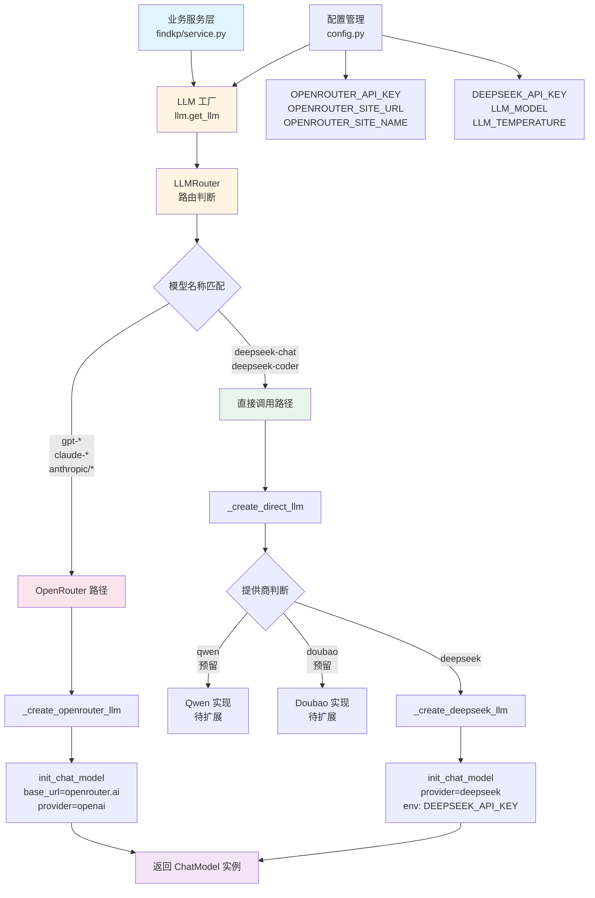

# LLM 配置模块架构设计

## 架构概览

本模块实现了统一的 LLM 工厂模式，支持通过 OpenRouter 调用国外 API，以及直接调用国内 API（如 DeepSeek）。

## 架构流程图



## 路由规则表

| 模型名称模式     | 路由方式           | 提供商    | API Key 来源                             |
| ---------------- | ------------------ | --------- | ---------------------------------------- |
| `deepseek-chat`  | 直接调用           | DeepSeek  | `DEEPSEEK_API_KEY`                       |
| `deepseek-coder` | 直接调用           | DeepSeek  | `DEEPSEEK_API_KEY`                       |
| `gpt-*`          | OpenRouter         | OpenAI    | `OPENROUTER_API_KEY` 或 `OPENAI_API_KEY` |
| `claude-*`       | OpenRouter         | Anthropic | `OPENROUTER_API_KEY` 或 `OPENAI_API_KEY` |
| `anthropic/*`    | OpenRouter         | Anthropic | `OPENROUTER_API_KEY` 或 `OPENAI_API_KEY` |
| `openai/*`       | OpenRouter         | OpenAI    | `OPENROUTER_API_KEY` 或 `OPENAI_API_KEY` |
| `meta-llama/*`   | OpenRouter         | Meta      | `OPENROUTER_API_KEY` 或 `OPENAI_API_KEY` |
| `google/*`       | OpenRouter         | Google    | `OPENROUTER_API_KEY` 或 `OPENAI_API_KEY` |
| 其他（未匹配）   | OpenRouter（默认） | OpenAI    | `OPENROUTER_API_KEY` 或 `OPENAI_API_KEY` |

## 代码组织结构

```
llm/
├── __init__.py          # 导出接口: get_llm, LLMRouter
└── factory.py            # 核心实现:
                           # - LLMRouter 类（路由逻辑）
                           # - get_llm() 工厂函数
                           # - _create_openrouter_llm()
                           # - _create_direct_llm()
                           # - _create_deepseek_llm()
```

## 配置项说明

### OpenRouter 配置

- `OPENROUTER_API_KEY`: OpenRouter API Key（可选，为空则使用 `OPENAI_API_KEY`）
- `OPENROUTER_SITE_URL`: 站点 URL（可选，用于 OpenRouter 排名，设置 `HTTP-Referer` header）
- `OPENROUTER_SITE_NAME`: 站点名称（可选，用于 OpenRouter 排名，设置 `X-Title` header）

### 国内 API 配置

- `DEEPSEEK_API_KEY`: DeepSeek API Key（必需，当使用 DeepSeek 模型时）

### LLM 通用配置

- `LLM_MODEL`: 模型名称（默认: `gpt-4o`）
- `LLM_TEMPERATURE`: 温度参数（默认: `0.0`）

## 使用示例

### 基本使用

```python
from llm import get_llm

# 使用默认配置（settings.LLM_MODEL）
llm = get_llm()

# 指定模型
llm = get_llm(model="deepseek-chat")

# 指定模型和温度
llm = get_llm(model="gpt-4o", temperature=0.7)
```

### 在服务层使用

```python
from llm import get_llm

class FindKPService:
    def __init__(self):
        self.llm = get_llm()  # 自动路由

    def extract_with_llm(self, prompt: str):
        response = self.llm.invoke([{"role": "user", "content": prompt}])
        return json.loads(response.content)
```

## 扩展指南

### 添加新的国内 API 提供商（以 Qwen 为例）

1. **更新路由规则**（`llm/factory.py`）:

```python
DOMESTIC_MODELS = {
    "deepseek-chat": "deepseek",
    "qwen-turbo": "qwen",      # 新增
    "qwen-plus": "qwen",        # 新增
    "qwen-max": "qwen",         # 新增
}
```

2. **添加配置项**（`config.py`）:

```python
QWEN_API_KEY: str = ""
```

3. **实现创建函数**（`llm/factory.py`）:

```python
def _create_qwen_llm(model: str, temperature: float, **kwargs):
    if not settings.QWEN_API_KEY:
        raise ValueError("Qwen API Key 未配置")

    os.environ["QWEN_API_KEY"] = settings.QWEN_API_KEY

    return init_chat_model(
        model=model,
        model_provider="qwen",  # 假设 langchain-qwen 支持此 provider
        temperature=temperature,
        **kwargs
    )
```

4. **更新路由函数**（`llm/factory.py`）:

```python
def _create_direct_llm(...):
    if provider_name == "deepseek":
        return _create_deepseek_llm(model, temperature, **kwargs)
    elif provider_name == "qwen":
        return _create_qwen_llm(model, temperature, **kwargs)  # 新增
    # ...
```

## 设计优势

1. **统一接口**: 所有业务模块通过 `get_llm()` 获取 LLM 实例，无需关心底层实现
2. **自动路由**: 根据模型名称自动选择提供商，减少配置复杂度
3. **易于扩展**: 新增提供商只需扩展工厂函数，不影响现有代码
4. **配置灵活**: 支持可选配置项，向后兼容
5. **类型安全**: 使用类型提示，提高代码可维护性
